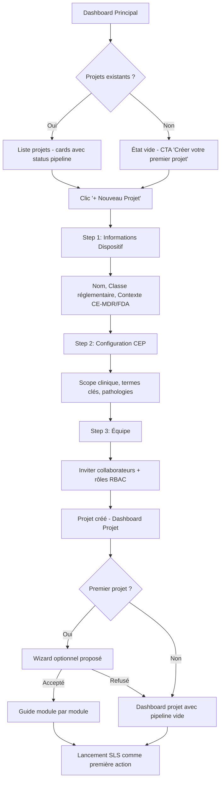
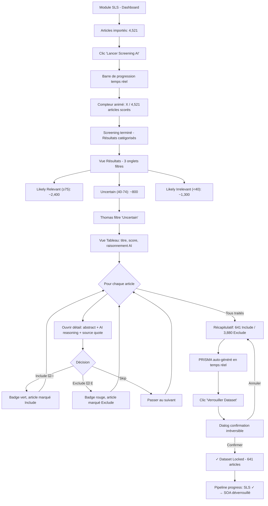
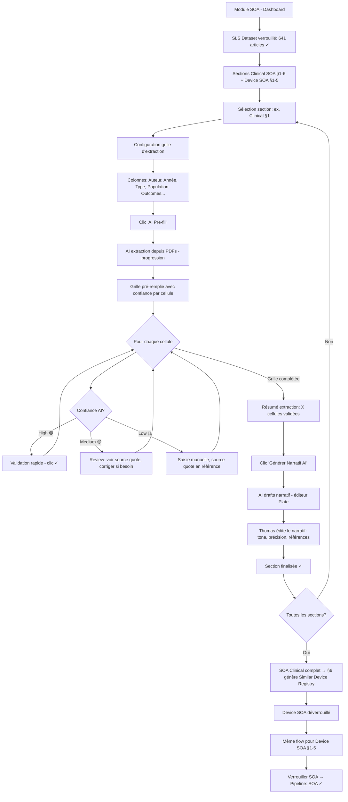
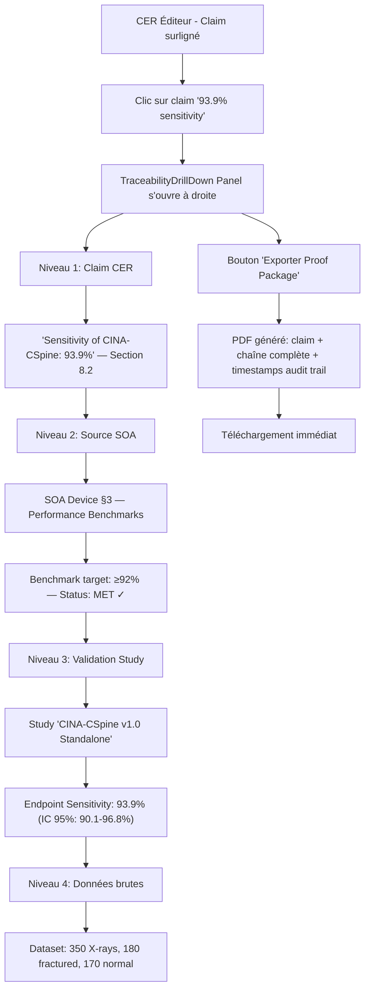

# UX Design Specification cortex-clinical-affairs

**Author:** Cyril
**Date:** 2026-02-13

---

## Executive Summary

### Project Vision

CORTEX Clinical Affairs Suite est une application web SaaS B2B desktop-first qui transforme la gestion de la conformité réglementaire des dispositifs médicaux. L'expérience utilisateur est centrée sur une promesse : **éliminer le temps perdu**. Là où les workflows traditionnels prennent des mois avec des outils fragmentés et des consultants coûteux, CORTEX orchestre le cycle complet (SLS → SOA → Validation → CER → PMS) dans une plateforme intégrée où chaque étape s'enchaîne avec fluidité.

Le moment fondateur de l'expérience : un Systematic Literature Search bouclé en 10 minutes — 4 500 articles screenés par l'IA, validés par l'humain, dataset verrouillé et prêt pour l'analyse. Cette vitesse, ressentie dès le premier module, définit le ton de toute l'expérience.

### Target Users

**Marie (Regulatory Affairs Manager)** — Utilisatrice principale, chef d'orchestre du processus CER. Experte réglementaire, tech-savvy intermédiaire. Travaille en open space sur grand écran, souvent avec Word et Excel ouverts en parallèle. Sa douleur principale : le temps perdu en compilation manuelle et le stress des audits. Son besoin UX : visibilité instantanée sur l'état du pipeline, traçabilité one-click, et exports submission-ready en un geste.

**Thomas (Clinical Affairs Specialist)** — Power user des modules SLS et SOA. Expert littérature scientifique, à l'aise avec les interfaces data-heavy (habitué aux bases PubMed, Cochrane). Travaille en sessions longues (plusieurs heures de screening/extraction). Son besoin UX : des tableaux performants (filtrage, tri, bulk actions), des grilles d'extraction efficaces, et une IA qui lui fait gagner du temps sans sacrifier le contrôle.

**Sophie (Consultante QA/RA externe)** — Utilisatrice multi-projets. Son besoin UX : onboarding rapide, interface standardisée et prévisible d'un projet à l'autre, templates réutilisables.

**Utilisateurs secondaires** — Auditeurs (read-only, drill-down traçabilité), Data Science (import XLS, vue benchmarks), Executives (dashboards status, décisions go/no-go). Interactions ponctuelles, pas de sessions longues.

### Key Design Challenges

1. **Complexité vs. Vitesse perçue** — 5 modules, 91+ fonctionnalités, mais chaque interaction doit sentir rapide et directe. La densité fonctionnelle ne doit jamais se traduire par une lourdeur d'interface. Progressive disclosure et contextual UI sont essentiels.

2. **Densité d'information en open space** — Tableaux de milliers d'articles, grilles d'extraction multi-colonnes, CER de 100+ pages. L'interface doit gérer la masse de données sans surcharger cognitivement, dans un environnement de travail où l'attention est fragmentée.

3. **Navigation dans un pipeline séquentiel rigide** — Les 5 modules ont des dépendances strictes (SLS locked avant SOA, etc.). L'utilisateur doit toujours savoir où il en est, ce qui est bloqué, et ce qu'il peut faire ensuite. Wayfinding et status visibility sont critiques.

4. **Confiance en l'IA réglementaire** — L'IA assiste mais ne décide jamais seule. Le design doit rendre les décisions AI transparentes (scores, raisonnement, source quotes) pour établir la confiance dans un domaine où les erreurs ont des conséquences réglementaires.

### Design Opportunities

1. **Le "flow state" de la vitesse** — La promesse SLS en 10 minutes crée un hook émotionnel puissant. Des indicateurs de progression en temps réel, des compteurs animés, et des transitions fluides peuvent transformer chaque module en une expérience de *momentum* — le sentiment que la machine travaille intensément pour l'utilisateur.

2. **La traçabilité comme superpouvoir UX** — Le drill-down one-click (claim CER → section SOA → article SLS) est potentiellement le moment "wow" le plus fort du produit. C'est l'antidote direct au stress d'audit : transformer l'anxiété en confiance absolue.

3. **Tonalité visuelle hybride** — Une identité visuelle qui mélange la sobriété professionnelle du médical (confiance, rigueur, clarté) avec la modernité des SaaS actuels (micro-interactions, typographie nette, espaces aérés). Ni froid/hospitalier, ni flashy/startup. Intelligent, confiant, et humain.

## Core User Experience

### Defining Experience

CORTEX a deux expériences core complémentaires qui définissent sa valeur :

**Expérience 1 — Le "Flow de Vélocité" (Thomas, SLS + SOA)**
L'action la plus fréquente : screener, analyser, extraire des articles scientifiques. Thomas passe des heures dans des tableaux denses. L'expérience doit transformer ce travail de fourmi en un flux rapide et assisté. L'IA fait le gros du travail (scoring, pré-remplissage des grilles), Thomas valide, corrige, affine. Le rythme ne doit jamais ralentir — chaque article traité est un pas visible vers le dataset verrouillé.

**Expérience 2 — Le "Moment de Vérité" (Marie, CER)**
L'action la plus critique : ouvrir le CER assemblé pour la première fois. C'est le moment make-or-break. Si le document AI-généré est structuré, tracé, et *ressemble* à un vrai CER soumissible — la confiance s'installe. Si c'est approximatif ou mal référencé, tout le workflow en amont perd sa crédibilité. Ce moment doit inspirer : "C'est déjà 80% fait, je n'ai qu'à raffiner."

### Platform Strategy

**Desktop-first, écran large :**
- Optimisé pour moniteurs 1920px+ (contexte open space, bureaux RA)
- Mouse/keyboard comme mode d'interaction principal
- Pas de version mobile — aucun use case critique ne le justifie en MVP
- Multi-onglets : les utilisateurs travaillent avec PubMed, Word, Excel ouverts en parallèle — CORTEX doit coexister sans monopoliser l'écran

**Web application (SaaS) :**
- Accès navigateur, pas d'installation locale
- Connexion permanente requise (pas de mode offline — les données réglementaires doivent rester synchronisées)
- Sessions longues (2-4h) — auto-save toutes les 10 secondes, pas de perte de travail

**Considérations open space :**
- Typographie lisible à distance (pas de texte trop petit)
- Contrastes suffisants sous éclairage néon
- Pas de sons/notifications audio intrusives — notifications visuelles discrètes

### Effortless Interactions

**Complètement automatique (zéro intervention utilisateur) :**
- Déduplication des articles à l'import (DOI, PMID, titre fuzzy)
- Calcul PRISMA en temps réel (toujours à jour, jamais un bouton "générer")
- Propagation des données entre modules (SOA benchmarks → Validation acceptance criteria → CER claims)
- Audit trails (invisibles, toujours actifs, jamais une action manuelle)
- Auto-numérotation des cross-références et bibliographie CER
- Détection des dépendances (verrouillage upstream automatiquement vérifié)

**Délibérément manuel (contrôle réglementaire) :**
- Décisions de screening (include/exclude) — même si l'IA suggère, l'humain décide
- Validation/correction des grilles d'extraction AI — pas d'auto-approve
- Approbation des narratifs CER — review section par section obligatoire
- Verrouillage des datasets/documents — action explicite et irréversible (avec confirmation)
- E-signatures — re-saisie mot de passe intentionnelle (21 CFR Part 11)

**Semi-automatique (AI propose, humain dispose) :**
- AI scoring de relevance → l'utilisateur voit le score + raisonnement, décide
- AI pré-remplissage grilles → l'utilisateur voit la confiance par cellule, corrige
- AI drafting narratifs → l'utilisateur édite dans un éditeur rich text (Plate)

### Critical Success Moments

**Moment 1 — Premier SLS bouclé (10 minutes)**
Thomas lance son premier screening AI. Le compteur tourne : "1 200 articles scorés... 2 800... 4 500 terminés." Il filtre les "uncertain", valide quelques cas limites, verrouille le dataset. PRISMA flowchart apparaît automatiquement. 10 minutes. Ce qui prenait 3 mois. C'est là que CORTEX gagne l'utilisateur.

**Moment 2 — Premier CER assemblé**
Marie clique "Assemble CER". Les 14 sections MDR Annex XIV apparaissent, pré-remplies par l'IA avec des références tracées. Elle clique sur un claim — drill-down instantané vers l'article source via la section SOA. Le document a une structure professionnelle. "C'est déjà 80% fait." C'est le moment de vérité.

**Moment 3 — Premier audit réussi**
L'auditeur demande une justification. Marie clique sur le claim, exporte le proof package en 30 secondes. L'auditeur sourit. C'est là que CORTEX devient indispensable. Ce moment ne peut pas être designé directement, mais tout le design en amont (traçabilité, drill-down, exports) le prépare.

**Moment anti-pattern — La perte de confiance**
Si l'AI propose un score de relevance sans explication, si un claim CER n'a pas de source, si un verrouillage échoue silencieusement — la confiance est brisée. En réglementaire, une erreur = un doute sur tout le système. Chaque interaction AI doit montrer pourquoi elle a décidé ce qu'elle a décidé.

### Experience Principles

1. **Vitesse perçue avant tout** — Chaque interaction doit sentir rapide. Progression en temps réel, transitions fluides, feedback immédiat. Même quand le système travaille en arrière-plan (AI scoring), l'utilisateur doit voir le momentum. Jamais de spinner sans contexte.

2. **Transparence AI totale** — L'IA ne fait rien "en boîte noire". Chaque score a un raisonnement, chaque extraction a une source quote, chaque narratif a ses références. L'utilisateur ne doit jamais se demander "pourquoi l'IA a fait ça ?". La confiance se construit par la transparence.

3. **Traçabilité en un clic** — De n'importe quel point du système, l'utilisateur peut remonter à la source en un seul clic. Claim CER → section SOA → cellule extraction → article → query SLS. Cette chaîne est le squelette de toute l'UX.

4. **Progressive disclosure** — Montrer l'essentiel d'abord, les détails à la demande. Un tableau de 4 500 articles ne montre pas 20 colonnes d'entrée — il montre titre, score, statut, et le reste se déplie. Un CER de 107 pages montre sa table des matières interactive, pas le texte brut.

5. **Irréversibilité visible** — Les actions irréversibles (verrouillage dataset, lock CER, e-signature) sont visuellement distinctes des actions courantes. Confirmation explicite, couleur différente, icône de cadenas. L'utilisateur ne verrouille jamais par accident.

## Desired Emotional Response

### Primary Emotional Goals

**Emotion signature : Maîtrise sereine**

L'émotion fondamentale que CORTEX doit inspirer est la maîtrise sereine — le sentiment profond que tout est sous contrôle, que chaque élément est tracé, que le système travaille *avec* l'utilisateur pour garantir la conformité. Ce n'est pas l'excitation d'un outil flashy, c'est la confiance calme d'un professionnel qui sait que son travail est solide.

Cette émotion se manifeste différemment selon les personas :
- **Marie** : "Je peux affronter n'importe quel audit sereinement"
- **Thomas** : "Je suis efficace, l'IA m'assiste sans me ralentir"
- **Sophie** : "Je retrouve mes repères instantanément, projet après projet"

**Emotion de protection : "Le système m'a protégé"**

Quand une erreur survient — import XLS mal formaté, article dupliqué, score AI incohérent — l'utilisateur ne doit jamais ressentir de panique. L'émotion cible est le soulagement protecteur : le système a détecté le problème avant qu'il ne cause des dégâts, il explique clairement ce qui s'est passé, et il guide vers la résolution. L'utilisateur se sent protégé, pas menacé.

### Emotional Journey Mapping

| Phase | Emotion "avant" (sans CORTEX) | Emotion cible (avec CORTEX) | Design implication |
|---|---|---|---|
| **Découverte / Onboarding** | Scepticisme ("encore un outil...") | Curiosité confiante ("ça a l'air sérieux et professionnel") | Interface sobre, crédible, pas de promesses marketing dans le produit |
| **Premier SLS (10 min)** | Lassitude ("5 000 articles...") | Émerveillement contrôlé ("ça va si vite !") | Compteurs temps réel, progression animée, feedback de vitesse |
| **Travail quotidien (SOA, extraction)** | Routine pénible | Flow productif — le temps passe sans qu'on s'en rende compte | Interface sans friction, raccourcis clavier, transitions fluides |
| **Assemblage CER** | Stress / surcharge | Maîtrise sereine ("c'est déjà 80% fait") | Structure claire, sections navigables, traçabilité visible partout |
| **Pré-audit** | Anxiété intense | Confiance absolue | One-click drill-down, proof packages instantanés |
| **Erreur / problème** | Panique ("qu'est-ce qui s'est cassé ?") | Soulagement protecteur ("le système a attrapé ça") | Messages d'erreur clairs, non-alarmistes, avec action corrective |
| **Retour au produit** | Résignation ("il faut y retourner...") | Anticipation positive ("où j'en étais ? Ah oui, là.") | État sauvegardé, reprise contextuelle, dashboard de progression |

### Micro-Emotions

**Confiance > Scepticisme (PRIORITAIRE)**
La confiance est le combat émotionnel central. Dans un domaine où une erreur peut invalider une soumission réglementaire, chaque interaction AI doit gagner la confiance de l'utilisateur. La transparence est le mécanisme : scores avec raisonnement, source quotes, niveaux de confiance par cellule. Le scepticisme s'installe quand l'IA agit sans s'expliquer.

**Accomplissement > Frustration**
Chaque étape franchie (dataset verrouillé, SOA finalisé, CER assemblé) est une micro-victoire. Le design doit marquer ces moments : feedback visuel satisfaisant, transition de statut claire, sentiment de progression tangible. L'utilisateur doit voir qu'il avance dans le pipeline.

**Calme > Anxiété**
L'interface ne crée jamais d'urgence artificielle. Le rouge est réservé aux vraies erreurs bloquantes. Les statuts utilisent des couleurs neutres et informatives. Les messages sont factuels, pas alarmistes. Même sous pression (deadline CER), l'interface reste un ancrage de calme.

**Sécurité > Vulnérabilité**
L'utilisateur ne doit jamais se sentir "seul face au risque". Les garde-fous sont visibles : avertissements de dépendance, confirmation avant verrouillage irréversible, détection proactive des incohérences. Le système est un filet de sécurité permanent.

### Design Implications

**Confiance → Transparence systématique**
- Chaque score AI affiche son raisonnement en hover/expand
- Chaque cellule d'extraction montre la source quote et le niveau de confiance
- Chaque claim CER montre sa chaîne de traçabilité complète
- Jamais d'action AI sans explication accessible

**Protection → Erreurs bienveillantes**
- Messages d'erreur en langage humain, pas technique : "L'import XLS contient 3 colonnes manquantes. Voici ce qu'il faut corriger." (pas "Error: schema validation failed")
- Couleur des erreurs : orange informatif pour les warnings, rouge uniquement pour les bloquants
- Toujours proposer l'action corrective à côté de l'erreur
- Les garde-fous préviennent avant l'erreur ("Attention : le Clinical SOA Section 6 n'est pas finalisé — le Device SOA pourrait être incomplet")

**Maîtrise → Visibilité permanente**
- Dashboard projet montrant l'état de chaque module en un coup d'oeil
- Barre de progression du pipeline toujours visible (SLS → SOA → Validation → CER → PMS)
- Indicateurs de complétude par section (CER : 12/14 sections rédigées, 98% traçabilité)

**Accomplissement → Feedback de progression**
- Animations subtiles lors des transitions de statut (draft → locked)
- Notifications positives : "Dataset verrouillé avec succès. 641 articles inclus. PRISMA flowchart prêt."
- Récapitulatifs de fin d'étape montrant ce qui a été accompli

**Calme → Interface sereine**
- Palette de couleurs apaisante (pas de contrastes agressifs)
- Espaces blancs généreux — l'interface respire malgré la densité de données
- Typographie claire et lisible (critère open space)
- Aucune notification audio — visuelles uniquement, non-intrusives

### Emotional Design Principles

1. **La confiance se gagne par la transparence, pas par les promesses** — Ne jamais dire "faites confiance à l'IA". Montrer pourquoi l'IA a pris cette décision. La confiance est une conséquence de la transparence, pas un prérequis.

2. **Protéger avant de signaler** — Le système attrape les problèmes en amont (dépendances non remplies, schéma XLS invalide, claims non tracés) et guide vers la solution. L'utilisateur se sent protégé, pas réprimandé.

3. **Marquer la progression, pas la pression** — Chaque micro-victoire (verrouillage, finalisation, export) est célébrée subtilement. Les deadlines sont informatives, jamais menaçantes. Le rythme est celui de l'utilisateur, pas du système.

4. **Le calme comme ancrage** — Dans un métier stressant (audits, conformité, deadlines), CORTEX est l'espace de calme. L'interface est un refuge de clarté et d'ordre dans le chaos réglementaire.

5. **L'irréversible est sacré** — Les actions qui ne peuvent pas être annulées (lock, e-signature) sont traitées avec gravité et respect. Confirmation claire, feedback distinctif, pas de possibilité d'erreur accidentelle. Le système protège l'utilisateur de lui-même.

## UX Pattern Analysis & Inspiration

### Inspiring Products Analysis

**Linear — La référence du workflow simple dans la complexité**

Linear gère des projets complexes (cycles, milestones, sprints, backlogs) avec une interface qui paraît simple. Ce qu'il fait remarquablement bien :
- **Sidebar gauche épurée** : Navigation principale en colonne, avec les projets, vues, et filtres. Jamais plus de 2 niveaux de profondeur visible. Le menu ne submerge pas.
- **Vitesse perçue** : Transitions instantanées entre vues, optimistic updates, raccourcis clavier omniprésents. L'interface réagit avant même que le serveur réponde.
- **Densité maîtrisée** : Beaucoup de données (issues, statuts, assignees) mais chaque vue montre exactement ce qu'il faut — ni plus, ni moins.
- **Palette sobre** : Fond clair/sombre neutre, couleurs d'accent utilisées avec parcimonie (statuts, priorités). Pas de surcharge chromatique.
- **Cmd+K** : Commande universelle — recherche, navigation, actions, tout accessible depuis un seul shortcut.

Pertinence pour CORTEX : Le modèle sidebar + contenu principal + navigation simple est directement transposable. La philosophie "montrer peu, permettre beaucoup" correspond parfaitement à un outil avec 91 FRs qui doit rester accessible.

**Figma — L'espace de travail structuré et les zones fonctionnelles**

Figma est un outil puissant avec une interface clairement zonée. Ce qui fonctionne :
- **Zones bien délimitées** : Toolbar en haut, panels latéraux gauche (layers) et droite (properties), canvas au centre. Chaque zone a une fonction claire, séparée visuellement.
- **Toolbar contextuelle** : La barre d'outils change selon ce qui est sélectionné — progressive disclosure par le contexte.
- **Icônes + tooltips** : Boutons compacts avec icônes, tooltips au hover qui expliquent sans encombrer. L'interface est dense mais lisible.
- **Navigation fluide** : Zoom, pan, undo/redo — navigation naturelle sans pensée consciente.
- **Panels rétractables** : Les panels latéraux se ferment pour maximiser l'espace de travail quand on n'en a pas besoin.

Pertinence pour CORTEX : Le zonage clair (sidebar fonctions | topbar progression | zone de travail centrale) est exactement le pattern décrit. Les panels rétractables sont essentiels pour un outil data-heavy en open space.

**Stripe Dashboard — La donnée complexe rendue lisible**

Stripe gère une complexité financière massive (paiements, abonnements, litiges, webhooks) avec une interface professionnelle et rassurante. Ce qui excelle :
- **Sidebar de navigation** : Structure arborescente simple, catégories claires, badge de notification discret.
- **Hiérarchie visuelle forte** : Titres, sous-titres, espacement — l'oeil sait immédiatement où regarder. Les données financières (qui doivent être exactes) sont mises en avant avec confiance.
- **Palette neutre + accents** : Fond blanc/gris clair, texte foncé, accents de couleur limités aux statuts (vert succès, orange warning, rouge erreur). Professionnel sans être froid.
- **Breadcrumbs et contexte** : Toujours savoir où l'on est dans la hiérarchie. Retour facile.
- **Espaces bien délimités** : Cards, dividers, sections clairement séparées — les données ne se mélangent jamais entre fonctions.

Pertinence pour CORTEX : La palette neutre avec accents de statut est parfaite pour CORTEX (sobre + informatif). Le pattern cards/sections pour séparer les fonctions correspond à la demande. La confiance visuelle de Stripe (données exactes, interface rassurante) s'aligne avec l'émotion "maîtrise sereine".

### Anti-Pattern : GitHub

Ce qu'il faut éviter :
- **Surcharge de navigation** : Tabs, sous-tabs, menus contextuels, breadcrumbs, sidebar — trop de niveaux de navigation simultanés. L'utilisateur se perd.
- **Accumulation de fonctionnalités** : Chaque feature ajoutée crée un nouveau tab ou panneau. Pas de refonte d'ensemble, juste de l'accumulation.
- **Incohérence visuelle** : Des pages qui ne se ressemblent pas selon les sections (Issues vs. Actions vs. Settings). Pas d'identité visuelle unifiée.
- **Densité non maîtrisée** : Certaines vues (PR diffs, Issues longues) n'ont pas de hiérarchie visuelle claire. Tout est au même niveau d'importance.
- **Navigation non linéaire** : Pas de sens clair de "progression" — on saute de page en page sans parcours guidé.

Leçon pour CORTEX : Le pipeline séquentiel (SLS → SOA → Validation → CER → PMS) est un avantage architectural — il impose une navigation linéaire claire. Ne jamais le perdre en accumulant des onglets et sous-menus.

### Transferable UX Patterns

**Pattern 1 — Sidebar fonctionnelle (Linear + Stripe)**
- Sidebar gauche fixe avec les fonctions principales du module actuel
- Icônes + labels courts, tooltips au hover
- 1 niveau de profondeur visible, sous-niveaux en expand
- Badge discret pour notifications/actions requises
- Rétractable pour maximiser l'espace de travail (Figma)

**Pattern 2 — Topbar de progression horizontale (Figma-inspired)**
- Barre horizontale en haut montrant les étapes du pipeline actif
- Étapes cliquables : navigation avant/arrière entre étapes
- Statut visuel par étape : complétée (check), en cours (highlight), verrouillée (cadenas), bloquée (grisée)
- Toujours visible — l'utilisateur ne perd jamais le fil de sa progression

**Pattern 3 — Zones fonctionnelles délimitées (Figma + Stripe)**
- Espace de travail découpé en zones visuellement distinctes (cards, sections, dividers)
- Chaque zone = une fonction claire (tableau d'articles, panel de détail, panneau d'actions)
- Espaces blancs comme séparateurs naturels, pas de bordures lourdes
- Panels rétractables pour adapter la densité au besoin

**Pattern 4 — Boutons icône + tooltip (Figma)**
- Actions fréquentes en icônes compactes avec tooltip descriptif au hover
- Actions importantes (lock, export, approve) avec label texte visible + icône
- Cohérence : même icône = même action partout dans l'app (cadenas = lock, partout)

**Pattern 5 — Navigation simple avant/arrière (Linear workflow)**
- Navigation principale : "Suivant" / "Précédent" pour avancer dans le workflow
- Breadcrumb discret pour le contexte hiérarchique (Projet > SLS > Session > Screening)
- Retour à l'étape précédente toujours accessible
- Pas de menus imbriqués à 3+ niveaux

**Pattern 6 — Palette neutre avec accents fonctionnels (Stripe)**
- Fond neutre (blanc cassé / gris très clair)
- Texte principal foncé, texte secondaire gris moyen
- Accents de couleur réservés aux statuts et actions : vert (complété/succès), bleu (en cours/actif), orange (warning/attention), rouge (erreur/bloquant uniquement)
- Jamais de couleur vive comme décoration — chaque couleur a une signification

### Design Inspiration Strategy

**Adopter directement :**
- Layout Linear : sidebar gauche + zone de contenu principale
- Palette Stripe : neutre avec accents de statut fonctionnels
- Boutons Figma : icônes compactes + tooltips
- Espaces délimités Stripe/Figma : cards et sections clairement zonées
- Vitesse perçue Linear : optimistic updates, transitions instantanées

**Adapter pour CORTEX :**
- Topbar de progression : adapter le pattern toolbar Figma en barre de progression horizontale du pipeline (SLS → SOA → Validation → CER → PMS) avec navigation avant/arrière
- Sidebar Linear : adapter pour les fonctions module-spécifiques (pas les mêmes items sidebar selon qu'on est dans SLS ou CER)
- Panels rétractables Figma : adapter pour le panel de détail article (SLS), le panel de source quote (SOA), le panel de traçabilité (CER)

**Éviter absolument :**
- Accumulation GitHub : ne jamais ajouter un tab sans repenser la navigation globale
- Incohérence GitHub : chaque module a le même squelette de layout (sidebar + topbar + contenu)
- Navigation non-linéaire GitHub : toujours maintenir le sens de progression du pipeline
- Surcharge de couleurs : pas de gradient, pas de couleurs vives décoratives, chaque couleur est fonctionnelle

## Design System Foundation

### Design System Choice

**shadcn/ui + Tailwind CSS 4** — Système thémable avec personnalisation totale.

Sélectionné dans l'architecture technique et confirmé comme le meilleur choix pour les besoins UX de CORTEX. Ce n'est ni un design system rigide (Material/Ant) qui impose un "look" reconnaissable, ni un système custom from scratch qui ralentirait le développement. C'est le juste milieu : des composants solides, accessibles, et entièrement personnalisables.

**Stack complète du design system :**
- **Tailwind CSS 4** — Utility-first, design tokens custom, zero runtime CSS
- **shadcn/ui** — Composants React basés sur Radix UI primitives (accessibilité native)
- **ag-Grid Enterprise 33** — Tableaux data-heavy (articles, grilles d'extraction, matrices GSPR)
- **Plate (Slate-based)** — Éditeur rich text pour narratifs CER/SOA sections
- **Lucide Icons** — Librairie d'icônes cohérente (déjà intégrée à shadcn/ui)

### Rationale for Selection

**Personnalisation totale pour l'identité CORTEX :**
shadcn/ui ne force aucun "look" — les composants sont des primitives accessibles (Radix UI) habillées par Tailwind. On peut atteindre l'esthétique Linear/Stripe sans friction, en définissant nos propres design tokens.

**Cohérence avec la stack architecture :**
Tailwind + shadcn/ui sont déjà choisis dans le document d'architecture (apps/web). Pas de friction d'intégration, pas de conflit avec ag-Grid ou Plate.

**Performance et bundle minimal :**
shadcn/ui est tree-shakable (on importe uniquement les composants utilisés). Tailwind 4 compile en CSS minimal. Pas de runtime JavaScript pour le styling — critique pour les sessions longues (2-4h) sur des vues data-heavy.

**Accessibilité native :**
Radix UI primitives (fondation de shadcn) gèrent nativement le focus management, keyboard navigation, screen reader support. Essentiel pour un outil professionnel utilisé intensivement.

### Implementation Approach

**Layer 1 — Design Tokens CORTEX (Tailwind config)**
Définir les tokens fondamentaux dans la configuration Tailwind :
- Couleurs : palette neutre (fonds, textes) + accents fonctionnels (statuts, actions)
- Typographie : font family, tailles, line heights optimisées pour la lisibilité open space
- Espacements : échelle cohérente pour le padding/margin (cards, sections, zones)
- Rayons de bordure : cohérents entre cards, boutons, inputs
- Ombres : subtiles, pour la hiérarchie visuelle (zones délimitées sans bordures lourdes)

**Layer 2 — Composants shadcn/ui rethémés**
Appliquer les tokens CORTEX aux composants shadcn existants :
- Button, Dialog, Card, Table, Input, Select, Tabs, Badge, Tooltip, Popover, Sheet
- Restyler via les CSS variables de shadcn (pas de fork des composants)
- Garantir cohérence : un Button CORTEX a toujours le même look, partout

**Layer 3 — Composants métier CORTEX**
Créer des composants spécifiques au domaine, construits au-dessus de shadcn :
- **PipelineProgressBar** — Topbar horizontale montrant la progression SLS → SOA → Validation → CER → PMS
- **StatusBadge** — Badge de statut unifié (draft, screening, locked, completed) avec couleurs sémantiques
- **LockConfirmation** — Dialog spécifique pour les actions irréversibles (lock dataset, lock CER)
- **AiConfidenceIndicator** — Indicateur visuel de confiance AI (high/medium/low) pour les cellules d'extraction
- **SourceQuotePopover** — Popover montrant la source quote au hover d'une cellule extraite
- **TraceabilityDrillDown** — Panel de navigation traçabilité (claim → SOA → article → query)
- **AsyncTaskPanel** — Panel latéral montrant les tâches en cours (AI scoring, report generation)
- **ESignatureModal** — Modal de signature électronique (re-saisie mot de passe + confirmation)

**Layer 4 — ag-Grid thémé CORTEX**
Appliquer les design tokens CORTEX au thème ag-Grid :
- Couleurs de header, lignes alternées, sélection
- Typographie cohérente avec le reste de l'app
- Icônes de tri/filtre alignées avec Lucide Icons
- Comportement de scroll et resize cohérent

### Customization Strategy

**Design Tokens comme source de vérité unique :**
Tous les tokens sont définis dans `packages/config-tailwind/tailwind.config.ts` et propagés via CSS variables. Changer une couleur de statut la change partout — shadcn, ag-Grid, Plate, composants custom.

**Convention de nommage des tokens :**
- `--cortex-bg-primary`, `--cortex-bg-secondary` (fonds)
- `--cortex-text-primary`, `--cortex-text-muted` (textes)
- `--cortex-status-draft`, `--cortex-status-locked`, `--cortex-status-completed` (statuts)
- `--cortex-accent-action`, `--cortex-accent-warning`, `--cortex-accent-error` (accents)

**Composants dans le monorepo :**
- shadcn/ui rethémés : `packages/ui/src/` (partagés entre toutes les features)
- Composants métier CORTEX : `apps/web/src/shared/components/` (spécifiques à l'app)
- Composants feature-spécifiques : `apps/web/src/features/{module}/components/` (spécifiques au module)

**Règle de cohérence :**
Chaque nouveau composant doit utiliser exclusivement les design tokens CORTEX. Jamais de couleur hardcodée, jamais de valeur magique. Si un token n'existe pas, on le crée dans la config Tailwind avant de l'utiliser.

## Defining Core Experience

### Defining Experience

**"Générer un CER submission-ready en 2 semaines au lieu de 6 mois."**

C'est la promesse fondamentale de CORTEX, exprimée comme une expérience utilisateur. Ce n'est pas une feature, c'est un résultat. Chaque module (SLS, SOA, Validation, CER, PMS) est un chapitre de cette histoire, et l'utilisateur doit sentir qu'il avance vers ce résultat à chaque interaction.

Le SLS en 10 minutes est le premier acte — la preuve de vitesse qui installe la confiance. L'assemblage CER est le climax — le moment où le document apparaît, structuré, tracé, prêt. Le PMS est l'épilogue — la boucle se ferme, le cycle continue.

L'interaction signature n'est pas un geste unique (comme le swipe de Tinder). C'est un flux orchestré : chaque module produit un livrable qui nourrit le suivant, et l'utilisateur voit la chaîne se construire sous ses yeux. La magie est dans l'enchaînement.

### User Mental Model

**Modèle mental actuel (sans CORTEX) :**
Marie et Thomas pensent en documents. Ils ont un Excel de screening, un Word de SOA, un autre Word de CER, des PDFs partout, des emails de consultants. Leur modèle mental est une pile de fichiers désorganisée. La traçabilité est un effort conscient — des cellules Excel avec des hyperliens fragiles.

**Modèle mental cible (avec CORTEX) :**
CORTEX doit déplacer le modèle mental de "pile de documents" vers "pipeline vivant". L'utilisateur ne pense plus en fichiers mais en étapes : "Mon SLS est verrouillé, mon SOA est en cours, mon CER attend." Chaque étape est un état, pas un fichier. La traçabilité n'est plus un effort — elle est inhérente au système.

**Points de friction potentiels :**
- L'habitude Excel/Word est profonde. Les utilisateurs voudront "exporter pour travailler dans Word". CORTEX doit être meilleur que Word pour l'édition de sections CER (éditeur Plate), sinon ils sortiront du pipeline.
- Le concept de "verrouillage irréversible" est nouveau. En Excel, on peut toujours modifier. CORTEX impose une discipline (draft → locked) qui peut frustrer au début — d'où l'importance du design émotionnel (protection, pas contrainte).
- L'IA comme assistante (pas remplaçante) demande un apprentissage. Les utilisateurs doivent comprendre que l'IA propose et qu'ils valident — pas l'inverse.

### Success Criteria

**L'utilisateur dit "ça marche" quand :**
1. Il ouvre le dashboard projet et voit instantanément où en est chaque module (pas de clic pour découvrir l'état)
2. Il passe d'un module au suivant sans jamais se demander "qu'est-ce que je fais maintenant ?"
3. L'AI scoring des articles se lance et il voit le compteur progresser en temps réel — le sentiment de vitesse
4. Il ouvre un CER assemblé et 80% du contenu est déjà exploitable — pas un brouillon, un vrai document
5. Il clique sur un claim et voit la source en une seconde — la traçabilité comme réflexe

**L'utilisateur dit "c'est cassé" quand :**
1. Il ne sait pas quelle est la prochaine étape à faire
2. L'IA a produit du contenu sans source visible — la confiance se brise
3. Un verrouillage a échoué ou s'est fait par accident sans confirmation claire
4. L'export DOCX ne ressemble pas à un vrai document soumissible (formatage cassé, références manquantes)
5. Il doit quitter CORTEX pour faire quelque chose dans Excel ou Word (signe que le produit n'a pas remplacé l'ancien workflow)

### Novel UX Patterns

**Patterns établis (familiers, adoption immédiate) :**
- Sidebar navigation (Linear/Stripe) — les utilisateurs B2B connaissent
- Tableaux avec tri/filtre (ag-Grid) — les utilisateurs Excel connaissent
- Rich text editor (Plate/Word-like) — les utilisateurs Word connaissent
- Formulaires structurés (protocoles, configurations) — pattern standard
- Export DOCX — attendu, pas surprenant

**Pattern innovant #1 — Pipeline Progress Bar (topbar)**
Pas standard dans les outils réglementaires. C'est un stepper horizontal persistant qui montre la progression du cycle complet (SLS → SOA → Validation → CER → PMS). Chaque étape est cliquable, avec un statut visuel (complétée, en cours, verrouillée, bloquée). C'est le fil d'Ariane du workflow — toujours visible, jamais perdu.

**Pattern innovant #2 — Traçabilité drill-down en cascade**
Pas de tableau de traçabilité statique. Un clic sur un claim CER ouvre un panel latéral qui montre la chaîne : claim → section SOA → cellule extraction → article SLS → query. Navigation en cascade, chaque niveau cliquable. C'est le "superpouvoir" UX de CORTEX — aucun concurrent n'offre ça.

**Pattern innovant #3 — AI transparency layer**
Chaque output AI (score, extraction, narratif) a une couche de transparence accessible : le raisonnement du score en expand, la source quote en hover, le niveau de confiance en badge coloré. Ce n'est pas un pattern standard — la plupart des outils AI montrent le résultat sans le "pourquoi".

**Pattern innovant #4 — Dashboard + wizard optionnel**
Le dashboard projet est le hub principal (style Linear). Lors du premier usage, un wizard optionnel se propose ("Première fois ? Je vous guide à travers les étapes."). L'utilisateur peut le refuser et naviguer librement. Les experts ne sont jamais ralentis, les nouveaux ne sont jamais perdus.

**Éducation des patterns nouveaux :**
- Pipeline progress bar : auto-explicatif grâce aux labels et icônes de statut
- Traçabilité drill-down : tooltip "Cliquez pour voir la source" sur les claims, demo lors de l'onboarding wizard
- AI transparency : les scores AI montrent toujours un indicateur cliquable pour voir le raisonnement

### Experience Mechanics

**1. Initiation — Démarrage d'un projet CER**

Marie crée un nouveau projet depuis le dashboard principal ("+ Nouveau projet"). Elle configure les informations de base : nom du dispositif, classe réglementaire, contexte réglementaire (CE-MDR / FDA). Le système crée le projet et affiche le dashboard projet avec le pipeline vide :

```
[SLS: Pas commencé] → [SOA: Bloqué] → [Validation: Bloqué] → [CER: Bloqué] → [PMS: Bloqué]
```

Si c'est sa première fois, un wizard optionnel apparaît : "Bienvenue ! Voulez-vous être guidé à travers les étapes ?" (Oui / Non, je connais). Le wizard, si accepté, explique chaque module en une phrase et lance le SLS comme première action.

**2. Interaction — Le flux module par module**

L'utilisateur travaille dans un module à la fois (SLS, puis SOA, etc.). Le layout est constant : sidebar gauche (fonctions du module) + topbar (pipeline progress) + zone de travail (contenu principal). Navigation : boutons "Suivant" / "Précédent" dans la topbar pour passer entre sous-étapes du module. Quand un module est terminé, l'utilisateur le verrouille (action explicite, confirmation dialog). Le pipeline progress bar se met à jour : l'étape passe en "complétée", la suivante se déverrouille.

**3. Feedback — L'utilisateur sait qu'il avance**

- Micro-feedback continu : compteurs en temps réel (articles scorés, sections rédigées, claims tracés)
- Feedback de statut : badges visuels sur chaque élément (draft, en cours, finalisé, verrouillé)
- Feedback de verrouillage : animation de transition (ouvert → cadenas fermé), notification positive ("641 articles inclus. Dataset verrouillé.")
- Feedback d'erreur protecteur : si une dépendance manque, message orange non-bloquant ("Le Clinical SOA §6 n'est pas encore finalisé. Le Device SOA pourrait être incomplet.")
- Feedback AI : barre de progression avec ETA ("AI scoring en cours... 2 800 / 4 500 articles. Estimation : 3 min restantes")

**4. Completion — Le CER est prêt**

Marie arrive au module CER. Les 14 sections sont pré-remplies par l'IA. Elle review section par section (éditeur Plate), ajuste le ton, vérifie les références. Le dashboard de complétude montre : "12/14 sections finalisées | Traçabilité : 98% | 3 claims non tracés". Elle résout les 3 claims non tracés, arrive à 100%. Elle clique "Finaliser CER" → confirmation → e-signature → CER verrouillé. Le système propose les exports : 20.CER (DOCX), CEP, PCCP, GSPR Table, FDA 18.CVS. Marie exporte le 20.CER. 107 pages. Submission-ready. Pipeline progress bar : tous les modules en vert. "Projet complet."

## Visual Design Foundation

### Color System

**Brand Palette — Cortex Blue comme ancrage identitaire**

La palette CORTEX est construite autour d'un bleu profond et confiant — `#0F4C81` (Cortex Blue) — qui incarne la rigueur réglementaire sans la froideur hospitalière. C'est un bleu qui inspire la compétence calme, aligné avec l'émotion "maîtrise sereine".

**Primary Scale (Cortex Blue) :**

| Token | Hex | Usage |
|---|---|---|
| `--cortex-blue-50` | `#F0F6FB` | Background hover, selected row subtle |
| `--cortex-blue-100` | `#E1EDF8` | Active background, sidebar selected |
| `--cortex-blue-200` | `#C2DCF0` | Focus rings, light accent areas |
| `--cortex-blue-300` | `#A4CBE8` | Disabled state accent, skeleton loaders |
| `--cortex-blue-400` | `#85BAE0` | Secondary button hover, links hover |
| `--cortex-blue-500` | `#0F4C81` | **PRIMARY** — Buttons, active states, links, pipeline progress |
| `--cortex-blue-600` | `#0D3F6A` | Button hover, active sidebar item |
| `--cortex-blue-700` | `#0A3153` | Button pressed, emphasis text |
| `--cortex-blue-800` | `#07233C` | Dark accent, topbar background option |
| `--cortex-blue-900` | `#051525` | Text primary, headings |

**Semantic State Colors :**

| Token | Hex | Rôle | Contexte CORTEX |
|---|---|---|---|
| `--cortex-success` | `#27AE60` | Complété, verrouillé, validé | Dataset locked, module completed, screening include |
| `--cortex-warning` | `#F39C12` | Attention, dépendance manquante | SOA section incomplète, confiance AI medium |
| `--cortex-error` | `#E74C3C` | Bloquant uniquement | Validation échouée, erreur import, claim non tracé |
| `--cortex-info` | `#3498DB` | Informatif, en cours | AI scoring en cours, sync en cours |

**Neutrals :**

| Token | Hex | Usage |
|---|---|---|
| `--cortex-bg-primary` | `#FFFFFF` | Zone de travail principale |
| `--cortex-bg-secondary` | `#F8F9FA` | Background page, sidebar, panels |
| `--cortex-bg-tertiary` | `#ECF0F1` | Cards, sections délimitées, input backgrounds |
| `--cortex-border` | `#E1EDF8` | Séparations subtiles entre zones |
| `--cortex-border-strong` | `#C2DCF0` | Séparations visibles, cards focus |
| `--cortex-text-primary` | `#051525` | Titres, texte principal |
| `--cortex-text-secondary` | `#2C3E50` | Corps de texte, labels |
| `--cortex-text-muted` | `#7F8C8D` | Texte secondaire, placeholders, timestamps |

**Button System (extrait de la brand palette) :**

| Type | Background | Texte | Usage CORTEX |
|---|---|---|---|
| Primary | `#0F4C81` | `#FFFFFF` | Actions principales (Lancer screening, Assembler CER) |
| Secondary | `#ECF0F1` | `#2C3E50` | Actions secondaires (Annuler, Retour) |
| Success | `#27AE60` | `#FFFFFF` | Confirmation positive (Verrouiller dataset, Approuver) |
| Danger | `#E74C3C` | `#FFFFFF` | Actions destructives (Supprimer, Rejeter) |
| Ghost | transparent | `#0F4C81` | Actions tertiaires (Voir détail, Filtrer) |

**Accessibility Compliance :**
- Cortex Blue (#0F4C81) sur blanc : ratio 10.2:1 — AAA ✓
- Texte primary (#051525) sur bg (#F8F9FA) : ratio > 15:1 — AAA ✓
- State colors sur blanc : tous > 3:1 pour large text, > 4.5:1 pour body — AA ✓
- Taille minimale body : 14px
- Touch targets minimum : 44×44px
- Dark mode ready : la palette scale (50→900) permet l'inversion sémantique

### Typography System

**Primary Typeface : Inter**

Inter est la police de référence pour les interfaces professionnelles desktop-first. C'est la police native de shadcn/ui, utilisée par Linear et Stripe — nos modèles d'inspiration directs. Elle offre :
- Lisibilité exceptionnelle sur écran, même en petit corps (14px+)
- Optimisée pour les textes UI (labels, boutons, menus, tableaux)
- Support complet des caractères latins étendus (noms de dispositifs médicaux, termes réglementaires français/allemand)
- Variable font : un seul fichier, poids ajustable de 100 à 900

**Fallback Typeface : system-ui**

Pour les cas de chargement lent ou les contextes hors-app (emails de notification, exports), la stack system-ui (`-apple-system, BlinkMacSystemFont, "Segoe UI", sans-serif`) assure la cohérence.

**Type Scale :**

| Token | Taille | Poids | Line Height | Usage |
|---|---|---|---|---|
| `--cortex-text-xs` | 12px | 400 | 1.5 | Timestamps, badges, footnotes |
| `--cortex-text-sm` | 14px | 400 | 1.5 | Body secondaire, labels de formulaire, cellules ag-Grid |
| `--cortex-text-base` | 16px | 400 | 1.6 | Body principal, paragraphes, descriptions |
| `--cortex-text-lg` | 18px | 500 | 1.5 | Sous-titres de section, titres de cards |
| `--cortex-text-xl` | 20px | 600 | 1.4 | Titres de page, titres de module |
| `--cortex-text-2xl` | 24px | 600 | 1.3 | Titres principaux, nom de projet |
| `--cortex-text-3xl` | 30px | 700 | 1.2 | Hero titles (dashboard, landing) |

**Conventions typographiques :**
- **Tableaux ag-Grid** : `text-sm` (14px) — optimisé pour la densité de données, lisible en open space à distance de bras
- **Éditeur CER (Plate)** : `text-base` (16px) — confort de lecture pour les sessions longues d'édition de narratifs
- **Sidebar navigation** : `text-sm` (14px) semi-bold pour les items actifs, regular pour les inactifs
- **Pipeline progress bar** : `text-sm` (14px) avec labels tronqués et tooltips pour les petits écrans
- **Nombres et métriques** : `tabular-nums` activé (Inter le supporte nativement) — alignement parfait des colonnes de chiffres dans ag-Grid

### Spacing & Layout Foundation

**Base Unit : 4px**

Tout l'espacement est construit sur un multiple de 4px (0.25rem). Cela permet une granularité fine pour les interfaces data-heavy (ag-Grid, grilles d'extraction) tout en maintenant un rythme vertical cohérent.

**Spacing Scale :**

| Token | Valeur | Usage principal |
|---|---|---|
| `--space-1` | 4px | Padding interne icône, gap micro |
| `--space-2` | 8px | Gap entre icône et label, padding badge |
| `--space-3` | 12px | Padding interne boutons, gap entre champs de formulaire |
| `--space-4` | 16px | Padding cards, margin entre éléments de liste |
| `--space-5` | 20px | Gap entre sections dans un formulaire |
| `--space-6` | 24px | Padding de zone (sidebar, panels), gap entre cards |
| `--space-8` | 32px | Margin entre sections majeures |
| `--space-10` | 40px | Padding de page, margin entre blocs de contenu |
| `--space-12` | 48px | Spacing entre zones fonctionnelles majeures |

**Layout Grid :**

L'application utilise un layout fixe à zones fonctionnelles (pas un grid 12 colonnes responsive) :

```
┌──────────────────────────────────────────────────────────────┐
│                    Topbar Pipeline (56px)                     │
├────────────┬─────────────────────────────────────────────────┤
│            │                                                 │
│  Sidebar   │              Zone de Travail                    │
│  (240px)   │              (flex-1)                           │
│            │                                                 │
│  Collaps.  │                                    ┌───────────┤
│  → 64px    │                                    │  Panel    │
│            │                                    │  Détail   │
│            │                                    │  (380px)  │
│            │                                    │  Retract. │
├────────────┴────────────────────────────────────┴───────────┤
│                    Statusbar (32px)                           │
└──────────────────────────────────────────────────────────────┘
```

- **Topbar** : 56px de hauteur, fixe. Pipeline progress bar + navigation avant/arrière + breadcrumb
- **Sidebar** : 240px, rétractable à 64px (icônes seules). Fonctions du module actif
- **Zone de travail** : flex-1, occupe tout l'espace restant. Contenu principal (tableaux, éditeur, dashboards)
- **Panel de détail** : 380px, rétractable (0px). Détail article, source quote, traçabilité drill-down
- **Statusbar** : 32px, optionnel. Infos contextuelles (auto-save status, connexion, raccourcis)

**Breakpoints :**

Desktop-first, pas de responsive mobile. Mais adaptation à la taille d'écran desktop :
- `≥ 1920px` : Layout complet avec panel de détail visible par défaut
- `1440px–1919px` : Panel de détail rétracté par défaut, ouvrable à la demande
- `1280px–1439px` : Sidebar en mode icône par défaut, panel de détail overlay
- `< 1280px` : Message "Écran trop petit — CORTEX est optimisé pour les écrans ≥ 1280px"

**Layout Principles :**
1. **Zones délimitées sans bordures lourdes** — Séparation par fond (bg-primary vs bg-secondary), ombres subtiles (`shadow-sm`), et espacement. Pas de bordures 1px visibles entre zones.
2. **Densité adaptative** — Les vues tableau (SLS screening, extraction) utilisent un espacement compact (`space-2` inter-lignes). Les vues édition (CER narratif) utilisent un espacement aéré (`space-4` inter-paragraphes).
3. **Respiration visuelle** — Malgré la densité de données, chaque zone fonctionnelle a un padding interne de `space-6` (24px). L'utilisateur ne se sent jamais "compressé".

### Accessibility Considerations

**WCAG 2.1 AA — Conformité vérifiée :**

La palette brand CORTEX a été conçue avec l'accessibilité comme contrainte fondamentale, pas comme afterthought.

**Contraste texte :**
- Texte primary (#051525) sur bg-primary (#FFFFFF) : 18.1:1 — AAA ✓
- Texte primary (#051525) sur bg-secondary (#F8F9FA) : 16.7:1 — AAA ✓
- Texte muted (#7F8C8D) sur bg-primary (#FFFFFF) : 4.6:1 — AA ✓ (large text AAA)
- Cortex Blue (#0F4C81) sur blanc : 10.2:1 — AAA ✓

**Contraste éléments interactifs :**
- Boutons primary (blanc sur #0F4C81) : 10.2:1 — AAA ✓
- Boutons success (blanc sur #27AE60) : 3.3:1 — AA large text ✓ (label texte 16px+)
- Boutons danger (blanc sur #E74C3C) : 4.0:1 — AA ✓
- Ghost buttons (Cortex Blue sur blanc) : 10.2:1 — AAA ✓

**States colors sur fond clair :**
- Success (#27AE60) sur bg-secondary (#F8F9FA) : 3.0:1 — ✓ (utilisé avec icône + label texte, jamais couleur seule)
- Warning (#F39C12) sur bg-secondary (#F8F9FA) : 2.3:1 — ⚠️ (toujours accompagné de texte ou icône, jamais couleur seule)
- Error (#E74C3C) sur bg-secondary (#F8F9FA) : 3.6:1 — ✓

**Tailles et cibles :**
- Body text minimum : 14px (cellules ag-Grid) — lisible en open space
- Touch/click targets : 44×44px minimum pour tous les boutons et éléments interactifs
- Focus visible : ring `cortex-blue-200` (2px) sur tous les éléments focusables
- Keyboard navigation : supportée nativement par Radix UI primitives (shadcn/ui)

**Dark Mode readiness :**
- La palette scale (50→900) permet une inversion sémantique propre : bg-primary → blue-900, text-primary → blue-50
- Non prioritaire en MVP (les open spaces ont un éclairage normalisé) mais architecturalement prêt via les CSS variables Tailwind

## Design Direction Decision

### Design Directions Explored

Six directions de design ont été explorées via un showcase HTML interactif (`ux-design-directions.html`), chacune montrant un mockup complet de l'interface CORTEX (vue SLS AI Screening) :

| Direction | Concept | Caractéristique clé |
|---|---|---|
| A — Linear Focus | Sidebar dark, minimalisme radical | Vitesse perçue maximale, whitespace dominant |
| B — Stripe Clarity | Tout-clair, hiérarchie typographique forte | Clarté data, métriques prominentes, cards shadow |
| C — Clinical Command | Topbar bleue proéminente, stepper numéroté | Densité data maximale, badges notifications |
| D — Warm Professional | Tons chauds, border-radius large | Approche accueillante, espacement généreux |
| E — Figma Workspace | Sidebar compacte icon-only, toolbar contextuelle | Workspace maximisé, panels flottants |
| F — Hybrid Velocity | Sidebar medium-dark, pipeline nodes connectés | Équilibre densité/respiration, detail panel |

### Chosen Direction

**Direction hybride B+F — "Hybrid Velocity avec clarté Stripe"**

Combinaison sélectionnée par fusion des directions B (Stripe Clarity) et F (Hybrid Velocity), prenant les forces de chacune :

| Élément | Source | Implémentation |
|---|---|---|
| **Sidebar** | F | Dark (#0A3153), icônes Lucide + labels courts, item actif en blue-100 (#E1EDF8) avec texte blue-50, rétractable à 64px (icônes seules) |
| **Pipeline topbar** | F | Nodes circulaires connectés par lignes, icônes de statut (cercle = en cours, cadenas = verrouillé, check = complété), labels texte sous les nodes |
| **Hiérarchie typographique** | B | Métriques en grande taille (text-2xl bold), titres forts (text-xl semibold), sous-titres en text-muted — style Stripe data-first |
| **Table rows** | F | Barre d'accent colorée à gauche de chaque ligne (3px, couleur = status : success/warning/error), hover en blue-50 |
| **Cards** | B | Box-shadows subtiles (`shadow-sm`), pas de bordures visibles, fond blanc sur page #F8F9FA — séparation par élévation |
| **Detail panel** | F | Panel droit (380px) rétractable, sections : Abstract, AI Reasoning (box blue-50 avec bordure gauche blue-400), Source Quote (italique, bordure gauche muted) |
| **Toolbar actions** | F | Boutons icône SVG + label texte, bouton primaire (blue-500) pour l'action principale, boutons ghost pour actions secondaires |
| **Background** | B | Page #F8F9FA, zone de travail principale #FFFFFF, sidebar #0A3153 — trois niveaux de fond distincts |
| **Statusbar** | F | 32px, fond #F8F9FA, dot vert auto-save, infos session, contexte module à droite |

### Design Rationale

**Pourquoi cette combinaison :**

1. **La sidebar dark (F) ancre l'identité CORTEX** — Le bleu foncé (#0A3153) crée un repère visuel stable, différencie clairement la navigation du contenu, et renforce l'émotion "maîtrise sereine". C'est le pattern Linear qui fonctionne le mieux pour les sessions longues (2-4h) : la sidebar est un ancrage calme pendant que le contenu change.

2. **La clarté typographique (B) optimise la lisibilité data** — Le style Stripe (métriques grandes, hiérarchie forte par taille et poids) est supérieur pour un outil qui manipule des milliers d'articles et des dizaines de métriques. L'oeil sait immédiatement où regarder.

3. **Les accent bars (F) donnent un status visuel instantané** — La barre colorée de 3px à gauche de chaque ligne de tableau communique le status (include/exclude/uncertain) sans nécessiter de lecture. C'est un pattern utilisé par Linear et GitHub Projects qui fonctionne particulièrement bien pour le screening d'articles.

4. **Les cards shadow (B) allègent l'interface** — Les bordures créent de la rigidité visuelle ; les ombres subtiles créent de la profondeur naturelle. Combinées avec le fond #F8F9FA, elles délimitent les zones fonctionnelles sans alourdir.

5. **Le pipeline nodes (F) communique le workflow séquentiel** — Les nodes connectés avec icônes de statut sont plus expressifs que de simples dots. Ils renforcent le modèle mental "pipeline vivant" et permettent la navigation avant/arrière.

### Implementation Approach

**Phase 1 — Design Tokens Tailwind**
Implémenter les tokens de couleur, typographie et spacing dans `packages/config-tailwind/tailwind.config.ts`. Inclut les 3 niveaux de fond (sidebar dark, page secondary, work area white), la scale typographique à 7 niveaux, et le spacing scale 4px.

**Phase 2 — Shell Layout**
Construire le layout principal : sidebar dark rétractable (240px → 64px) + topbar pipeline (56px) + zone de travail (flex-1) + detail panel rétractable (380px) + statusbar (32px). Le shell est identique pour tous les modules — seuls le contenu sidebar et la zone de travail changent.

**Phase 3 — Composants shadcn rethémés**
Appliquer les tokens CORTEX aux composants shadcn/ui : Button (5 variantes), Card (shadow-sm, pas de border), Table (accent bars, hover blue-50), Badge (status colors), Tooltip, Dialog, Input, Select.

**Phase 4 — Composants métier**
Construire les composants spécifiques : PipelineProgressBar, StatusBadge, AiConfidenceIndicator, SourceQuotePopover, TraceabilityDrillDown, ArticleDetailPanel.

**Phase 5 — Thème ag-Grid**
Aligner le thème ag-Grid avec les tokens CORTEX : header en #F8F9FA, lignes alternées subtiles, sélection en blue-50, typographie Inter 14px, icônes Lucide pour tri/filtre.

## User Journey Flows

### Journey 1 — Project Setup & Onboarding

**Persona :** Marie (RA Manager)
**Objectif :** Créer un nouveau projet CER et configurer le pipeline
**Durée cible :** < 5 minutes
**Émotion :** Curiosité confiante → "ça a l'air sérieux et professionnel"

**Flow narratif :**
Marie arrive sur le dashboard principal. Elle voit ses projets existants (cards avec statut pipeline). Elle clique "+ Nouveau projet". Un formulaire en 3 étapes apparaît :
1. **Informations dispositif** : nom, classe réglementaire, contexte (CE-MDR / FDA / les deux)
2. **Configuration CEP** : scope clinique, termes clés, pathologies cibles
3. **Équipe** : invitation des collaborateurs (Thomas, Sophie), rôles RBAC

Si c'est sa première fois, le wizard optionnel se propose après la création. S'il est accepté, il guide module par module avec une explication en une phrase chacun, puis lance le SLS comme première action.



**Points de design critiques :**
- Le formulaire de création est un stepper horizontal (cohérent avec la topbar pipeline)
- Auto-save à chaque étape — si Marie ferme accidentellement, elle reprend où elle était
- Le wizard est non-intrusif : un banner discret en haut du dashboard, pas un modal bloquant
- Les projets existants montrent le pipeline miniature (5 dots colorés) pour un status instantané

### Journey 2 — SLS AI Screening

**Persona :** Thomas (Clinical Specialist)
**Objectif :** Screener 4 500 articles avec assistance AI, obtenir un dataset verrouillé
**Durée cible :** 10-30 minutes (selon le nombre de "uncertain")
**Émotion :** Émerveillement contrôlé → "ça va si vite !"

**Flow narratif :**
Thomas entre dans le module SLS. Il a déjà importé les articles (4 521 articles dédupliqués). Il lance le screening AI. Un panneau de progression temps réel apparaît : compteur animé "1 200 articles scorés... 2 800... 4 500 terminés." L'AI catégorise chaque article en Likely Relevant (score ≥ 75), Uncertain (40-74), Likely Irrelevant (< 40).

Thomas filtre sur "Uncertain" (≈ 800 articles). Il travaille en vue tableau : titre, abstract preview, AI score avec raisonnement en expand, boutons Include/Exclude. Navigation clavier : ↑↓ pour naviguer, I pour Include, E pour Exclude, Espace pour ouvrir le détail. Il traite les 800 articles en session. Puis il verrouille le dataset.



**Points de design critiques :**
- La barre de progression AI est le moment émotionnel clé — compteur animé, ETA estimée, sensation de vitesse
- Navigation clavier (I/E/Espace/↑/↓) pour le flow de screening rapide — Thomas ne touche pas la souris
- Le raisonnement AI est visible en un clic (expand row) — transparence totale
- Le score AI a un badge coloré (vert ≥ 75, orange 40-74, rouge < 40) — lecture instantanée
- Le PRISMA se met à jour en temps réel pendant le screening — feedback de progression
- Le verrouillage a un dialog spécifique (LockConfirmation) — irréversibilité visible

### Journey 3 — SOA Extraction & Narrative

**Persona :** Thomas (Clinical Specialist)
**Objectif :** Extraire les données des articles et rédiger les sections SOA
**Durée cible :** 2-4 jours (sessions longues)
**Émotion :** Flow productif → le temps passe sans qu'on s'en rende compte

**Flow narratif :**
Thomas entre dans le module SOA. Le système montre les sections MDR : Clinical §1-6, Device §1-5. Il commence par le Clinical SOA. Pour chaque section, il configure la grille d'extraction (colonnes : auteur, année, type d'étude, population, intervention, outcomes, etc.). L'IA pré-remplit les cellules à partir des PDFs. Thomas voit un indicateur de confiance par cellule (high/medium/low). Il valide les cellules high-confidence, corrige les medium/low. Puis il passe à la rédaction du narratif AI-assisté.



**Points de design critiques :**
- La grille d'extraction est un ag-Grid avec AiConfidenceIndicator par cellule (badge coloré H/M/L)
- Le SourceQuotePopover s'affiche au hover d'une cellule — l'utilisateur voit la source immédiatement
- L'éditeur narratif (Plate) est inline — pas de modal, pas de changement de contexte
- La progression section par section est visible dans la sidebar (check par section finalisée)
- Le flow extraction → narratif est un pattern répétable pour chaque section — consistance

### Journey 4 — CER Assembly & Review

**Persona :** Marie (RA Manager)
**Objectif :** Assembler le CER AI-généré et le finaliser pour soumission
**Durée cible :** 1-2 jours
**Émotion :** Maîtrise sereine → "c'est déjà 80% fait, je n'ai qu'à raffiner"

**Flow narratif :**
Marie entre dans le module CER. Le dashboard montre les dépendances : SLS ✓, SOA ✓, Validation ✓ — tout est prêt. Elle clique "Assembler CER". L'AI génère les 14 sections MDR Annex XIV. Marie voit la table des matières interactive avec un indicateur de complétude par section. Elle review section par section dans l'éditeur Plate, ajuste le ton, vérifie les références. Le dashboard de complétude se met à jour : "12/14 sections finalisées | Traçabilité : 98%". Elle résout les 3 claims non tracés. 100%. E-signature. Export.

```mermaid
flowchart TD
    A[Module CER - Dashboard] --> B{Dépendances vérifiées?}
    B -->|SLS ✓ SOA ✓ Validation ✓| C["Clic 'Assembler CER'"]
    B -->|Manquante| D[Message: dépendance X non verrouillée]

    C --> E[AI génère 14 sections MDR Annex XIV]
    E --> F[Progression: sections générées 1/14... 14/14]
    F --> G[CER assemblé - Table des matières interactive]

    G --> H[Dashboard complétude: X/14 sections, Y% traçabilité]
    H --> I[Sélection section à reviewer]

    I --> J[Éditeur Plate - Narratif AI avec références inline]
    J --> K[Marie édite: ton, précision, formulations]
    K --> L{Références tracées?}
    L -->|Oui| M[Section marquée 'Finalisée' ✓]
    L -->|Non| N[Claims non tracés surlignés en orange]
    N --> O[Clic claim → TraceabilityDrillDown]
    O --> P[Lier claim à source SOA/SLS]
    P --> M

    M --> Q{Toutes les sections finalisées?}
    Q -->|Non| I
    Q -->|Oui| R[Dashboard: 14/14 ✓ | Traçabilité 100%]

    R --> S["Clic 'Finaliser CER'"]
    S --> T[Dialog: récapitulatif final + avertissement irréversible]
    T --> U[E-Signature: re-saisie mot de passe]
    U --> V[CER Verrouillé ✓]
    V --> W[Export proposé: 20.CER DOCX, CEP, PCCP, GSPR, FDA 18.CVS]
    W --> X["Pipeline: CER ✓ → PMS déverrouillé"]
```

**Points de design critiques :**
- L'assemblage AI est un moment fort — la progression "sections générées 1/14... 14/14" crée le momentum
- La table des matières interactive montre l'état de chaque section (draft, review, finalisé) — vue d'ensemble instantanée
- Les claims non tracés sont surlignés en orange dans l'éditeur — jamais cachés, toujours visibles
- La complétude (14/14 sections, 98% traçabilité) est un compteur motivant — le "presque fini" pousse à finir
- L'e-signature est un moment solennel — UI distincte (ESignatureModal), pas un simple bouton

### Journey 5 — Traceability Drill-Down

**Persona :** Marie (RA Manager) / Auditeur (lecture seule)
**Objectif :** Remonter d'un claim CER à sa source primaire en 1 clic
**Durée cible :** < 5 secondes
**Émotion :** Confiance absolue → "je peux justifier chaque affirmation"

**Flow narratif :**
Un auditeur demande la justification du claim "Sensitivity 93.9%" (page 47 du CER). Marie clique sur le claim dans l'éditeur CER. Le TraceabilityDrillDown panel s'ouvre à droite. Il montre la chaîne complète en cascade :

```
Claim CER → Section SOA Device §3 → Validation Study "CINA-CSpine v1.0"
→ Endpoint: Sensitivity 93.9% → SOA Benchmark: ≥92% (target met)
```

Chaque niveau est cliquable. Marie peut exporter le "proof package" en un clic.



**Points de design critiques :**
- Le drill-down est une navigation en cascade dans le panel droit — chaque niveau est une "card" cliquable
- Chaque niveau montre le contexte minimum nécessaire (pas toute la section, juste le point pertinent)
- Le bouton "Exporter Proof Package" est toujours visible en haut du panel — action immédiate
- L'audit trail (timestamps, utilisateur, action) est visible en expand à chaque niveau
- Le panel se ferme avec Escape ou clic hors panel — non-intrusif

### Journey Patterns

**Patterns communs extraits des 5 journeys :**

**Pattern 1 — Progression séquentielle avec verrouillage**
Chaque module suit le même rythme : configurer → exécuter (avec AI) → valider → verrouiller. Le verrouillage est toujours explicite (LockConfirmation dialog), irréversible, et met à jour le pipeline. Ce pattern est le squelette de toute l'UX.

**Pattern 2 — AI propose, humain dispose**
Chaque interaction AI suit le même flow : l'AI produit un résultat (score, extraction, narratif) → l'utilisateur voit le résultat + le raisonnement AI + le niveau de confiance → l'utilisateur valide, corrige, ou rejette. Jamais d'auto-approve.

**Pattern 3 — Detail panel contextuel**
Le panel droit (380px) est le véhicule universel pour le détail : détail article (SLS), source quote (SOA), traçabilité drill-down (CER), grille d'extraction expandée. Même position, même comportement, contenu adapté au contexte.

**Pattern 4 — Feedback de progression multi-niveau**
Trois niveaux de feedback toujours visibles :
- **Pipeline** (topbar) : progression globale du projet (SLS → SOA → ... → PMS)
- **Module** (sidebar) : progression des sous-étapes du module actif (sections, sessions)
- **Tâche** (zone de travail) : progression de l'action en cours (articles scorés, cellules validées, sections rédigées)

**Pattern 5 — Navigation clavier pour le power user**
Les actions fréquentes ont des raccourcis clavier : I (Include), E (Exclude), ↑↓ (naviguer), Espace (détail), Escape (fermer panel), Cmd+S (sauvegarder). Le power user (Thomas) ne touche jamais la souris dans ses sessions de screening.

### Flow Optimization Principles

1. **Minimum de clics vers la valeur** — Chaque journey est optimisé pour le minimum d'étapes entre l'intention et le résultat. Le SLS screening est un flux continu (pas de pages, pas de modals intermédiaires). L'assemblage CER est un clic ("Assembler") pas un wizard en 14 étapes.

2. **Pas de cul-de-sac** — Chaque écran a toujours une action suivante claire. Après le verrouillage SLS, le système propose d'aller au SOA. Après l'export CER, le système propose le PMS. L'utilisateur n'est jamais "perdu" à se demander quoi faire.

3. **Erreurs récupérables avant verrouillage** — Tant qu'un module n'est pas verrouillé, tout est modifiable. Les erreurs (mauvais score AI, extraction incorrecte) sont corrigeables sans friction. Le verrouillage est le seul point de non-retour — d'où son traitement UX solennel.

4. **Chargement optimiste pour la vitesse perçue** — Les transitions entre vues sont instantanées (optimistic updates). Les données se chargent en arrière-plan. L'utilisateur ne voit jamais un écran vide avec un spinner sans contexte.

5. **Contexte préservé à la reprise** — Quand Thomas revient après une pause, il retrouve exactement l'état où il a quitté : même vue, même filtre, même article sélectionné. Auto-save toutes les 10 secondes. Zéro perte de travail.

## Component Strategy

### Design System Components

**shadcn/ui — Composants disponibles et leur usage CORTEX :**

| Composant shadcn | Usage CORTEX | Personnalisation |
|---|---|---|
| **Button** | Actions primaires/secondaires/ghost/danger/success | 5 variantes avec tokens CORTEX, icône SVG optionnelle |
| **Card** | Containers de contenu (dashboard, sections) | Shadow-sm, pas de border, fond blanc sur #F8F9FA |
| **Dialog** | Confirmations, modals de configuration | Style CORTEX, backdrop blur subtle |
| **Table** | Tableaux légers (résumés, comparaisons) | Accent bar gauche, hover blue-50 |
| **Input / Textarea** | Formulaires (projet setup, CEP config, recherche) | Border blue-200 focus, bg #ECF0F1 |
| **Select** | Dropdowns (filtres, sélection classe réglementaire) | Combobox pour recherche dans les options |
| **Tabs** | Navigation intra-module (SLS: Dashboard/Screening/PRISMA) | Active = border-bottom blue-500 |
| **Badge** | Status (Include/Exclude/Uncertain, Draft/Locked) | Couleurs sémantiques state colors |
| **Tooltip** | Aide contextuelle, descriptions icônes sidebar | Fond #07233C, texte blanc, 200ms delay |
| **Popover** | Détails rapides (source quotes, AI reasoning preview) | Max-width 360px, fond blanc |
| **Sheet** | Panel latéral (detail panel 380px) | Slide from right, overlay ou push |
| **Progress** | Barres de progression (AI screening, export) | Blue-500, animated striped pendant loading |
| **Separator** | Séparation entre sections dans sidebar/panels | Blue-200 subtle |
| **Dropdown Menu** | Actions contextuelles (clic droit table, export options) | Icônes Lucide alignées |
| **Command** | Palette de commandes Cmd+K (recherche, navigation rapide) | Full-screen overlay, recherche fuzzy |
| **Alert** | Messages d'état (erreur import, dépendance manquante) | 4 variantes : info/success/warning/error |
| **Skeleton** | Loading states (chargement grilles, articles) | Blue-100 animated pulse |
| **Toast** | Notifications éphémères (auto-save, action confirmée) | Bottom-right, auto-dismiss 5s |
| **Breadcrumb** | Contexte hiérarchique (Projet > SLS > Screening) | Text-muted, dernier item text-primary |
| **Scroll Area** | Zones scrollables (sidebar, detail panel, éditeur) | Scrollbar fine, blue-200 |
| **Toggle** | Switches on/off (paramètres, filtres actifs) | Blue-500 active state |

**ag-Grid Enterprise — Composants data-heavy :**

| Composant ag-Grid | Usage CORTEX |
|---|---|
| **Grid principal** | SLS articles (4 500+ rows), SOA extraction grids, GSPR matrix |
| **Column filtering** | Filtrage par score AI, statut, année, source |
| **Row selection** | Bulk actions (include/exclude multiple articles) |
| **Cell rendering** | Custom renderers pour AI scores, status badges, confidence indicators |
| **Row grouping** | Groupement par source, année, type d'étude |
| **Export** | Export CSV/Excel des datasets |
| **Infinite scroll** | Performance sur 4 500+ articles |

**Plate (Slate-based) — Composants éditeur :**

| Composant Plate | Usage CORTEX |
|---|---|
| **Rich text editor** | Narratifs SOA, sections CER |
| **Toolbar formatting** | Bold, italic, headings, lists, tables inline |
| **Inline references** | Citations [1], [2] avec hover popover vers source |
| **Comments** | Annotations de review (Marie sur les sections CER) |
| **Track changes** | Diff AI vs. éditions humaines (optionnel post-MVP) |

### Custom Components

**8 composants métier spécifiques à CORTEX, non disponibles dans shadcn/ui :**

#### 1. PipelineProgressBar

**Purpose :** Visualiser la progression du pipeline complet (SLS → SOA → Validation → CER → PMS) dans la topbar.
**Anatomy :**
- 5 nodes circulaires connectés par des lignes horizontales
- Chaque node : icône de statut (cercle = en cours, check = complété, cadenas = verrouillé, grisé = bloqué)
- Label texte sous chaque node (nom du module)
- Ligne de connexion : pleine si complété, pointillée si non-atteint

**States :**

| State | Apparence | Interaction |
|---|---|---|
| Not started | Cercle grisé (#7F8C8D), label muted | Non-cliquable |
| Blocked | Cercle grisé + icône cadenas, label muted | Tooltip "Dépend de X" |
| Active | Cercle blue-500 pulsant, label bold | Cliquable → navigue au module |
| Completed | Cercle success (#27AE60) + check, label normal | Cliquable → navigue au module |
| Locked | Cercle success + cadenas, label normal | Cliquable → vue read-only |

**Accessibility :** `role="navigation"`, `aria-label="Pipeline progression"`, `aria-current="step"` sur le module actif. Navigation clavier ←→ entre nodes.

#### 2. StatusBadge

**Purpose :** Afficher un statut unifié sur n'importe quel élément (article, section, module, dataset).
**Anatomy :** Pill avec icône + label texte, couleur de fond sémantique.

**Variants :**

| Variant | Couleur | Icône | Usage |
|---|---|---|---|
| draft | Blue-100 / Blue-700 | Cercle vide | Section en cours de rédaction |
| screening | Info-100 / Info-700 | Loupe | Article en phase de screening |
| uncertain | Warning-100 / Warning-700 | Point d'interrogation | Article à reviewer manuellement |
| include | Success-100 / Success-700 | Check | Article inclus |
| exclude | Error-100 / Error-700 | X | Article exclu |
| locked | Blue-800 / White | Cadenas | Dataset/document verrouillé |
| completed | Success-100 / Success-700 | Check double | Module terminé |

**Accessibility :** `role="status"`, texte du label toujours présent (pas uniquement la couleur).

#### 3. LockConfirmation

**Purpose :** Dialog de confirmation pour les actions irréversibles (verrouillage dataset, CER, e-signature).
**Anatomy :**
- Dialog centré, backdrop blur fort (distinctif des dialogs normaux)
- Icône cadenas grande (40px) en blue-800
- Titre : "Verrouiller [nom de l'élément]"
- Message : description claire de l'irréversibilité + conséquences
- Récapitulatif : métriques clés (ex: "641 articles, PRISMA généré")
- Checkbox : "Je comprends que cette action est irréversible"
- Boutons : "Annuler" (secondary) + "Verrouiller" (danger, disabled tant que checkbox non cochée)

**States :** Default → Checkbox cochée → Confirmation → Processing (spinner) → Succès (check animé)
**Accessibility :** Focus trap, `aria-modal="true"`, `aria-describedby` sur le message d'avertissement.

#### 4. AiConfidenceIndicator

**Purpose :** Afficher le niveau de confiance AI sur une cellule d'extraction ou un score.
**Anatomy :**
- Badge compact (16px height) avec label court : "H" / "M" / "L"
- Couleur : High = success, Medium = warning, Low = error
- Hover : popover avec le raisonnement AI (source quote, facteurs de confiance)

**States :**

| State | Apparence | Interaction |
|---|---|---|
| High (≥ 80%) | Badge vert "H" | Hover → "High confidence: source quote found, extraction matches" |
| Medium (50-79%) | Badge orange "M" | Hover → "Medium: partial match, review recommended" |
| Low (< 50%) | Badge rouge "L" | Hover → "Low: no direct source quote, manual verification needed" |
| Validated | Badge vert + check overlay | Cellule validée par l'utilisateur |
| Corrected | Badge bleu + edit overlay | Cellule corrigée manuellement |

**Accessibility :** `aria-label="AI confidence: [level]"`, popover accessible au focus clavier.

#### 5. SourceQuotePopover

**Purpose :** Afficher la citation source d'un article au hover d'une cellule d'extraction.
**Anatomy :**
- Popover positionné sous/à côté de la cellule
- Fond blue-50, bordure gauche blue-400 (3px)
- Texte de la citation en italique (text-sm)
- Référence de l'article (auteur, année, journal) en text-muted
- Numéro de page si disponible
- Bouton "Voir l'article complet" (ghost)

**States :** Hidden → Hover (200ms delay) → Visible → Click "voir article" → Navigation
**Accessibility :** `role="tooltip"`, `aria-describedby`, visible au focus clavier (Tab).

#### 6. TraceabilityDrillDown

**Purpose :** Panel de navigation en cascade pour remonter d'un claim CER à sa source primaire.
**Anatomy :**
- Panel droit (utilise Sheet shadcn comme base)
- Header : titre du claim + bouton "Exporter Proof Package"
- Cascade de cards empilées verticalement, chaque card = un niveau de traçabilité
- Chaque card : icône de type (CER/SOA/SLS/Validation), titre, extrait pertinent, lien cliquable
- Connecteurs verticaux entre les cards (ligne pointillée blue-200)
- Footer : audit trail expandable (timestamps, actions, utilisateurs)

**States :** Closed → Opening (slide-in animation 200ms) → Open → Navigating levels → Exporting
**Accessibility :** Focus management dans le panel, `aria-label="Traceability navigation"`, Escape pour fermer.

#### 7. AsyncTaskPanel

**Purpose :** Afficher les tâches asynchrones en cours (AI screening, report generation, export).
**Anatomy :**
- Panel compact en bas-droite ou dans la statusbar
- Liste des tâches actives avec : nom, barre de progression, ETA
- Chaque tâche : icône type (AI = brain, export = download, sync = arrows)
- Notification badge sur l'icône panel quand des tâches sont actives
- Expandable : clic pour voir le détail de chaque tâche

**States :** No tasks (hidden) → Tasks running (badge count) → Task completed (toast + check animé) → Task failed (toast error + retry button)
**Accessibility :** `role="status"`, `aria-live="polite"` pour les mises à jour de progression.

#### 8. ESignatureModal

**Purpose :** Dialog de signature électronique pour les actions réglementaires (21 CFR Part 11).
**Anatomy :**
- Dialog fullscreen-ish (max-width 480px, centré)
- Icône signature (shield + pen) en blue-800
- Titre : "Signature électronique requise"
- Contexte : nom du document, action, implications réglementaires
- Champ mot de passe (re-saisie obligatoire)
- Mention légale : "Cette signature a la même valeur juridique qu'une signature manuscrite"
- Boutons : "Annuler" + "Signer et verrouiller"

**States :** Default → Password entered → Signing (spinner) → Signed (check animé + confetti subtle)
**Accessibility :** Focus trap strict, `aria-modal="true"`, champ password avec `autocomplete="current-password"`.

### Component Implementation Strategy

**Principe directeur : Composition over creation**

Chaque composant custom est construit en composant des primitives shadcn/ui existantes. Aucun composant n'est créé from scratch — on réutilise Dialog, Popover, Sheet, Badge, Button, Progress comme blocs de base.

**Hiérarchie des composants :**

```
packages/ui/src/                    ← shadcn/ui rethémés (partagés)
├── button.tsx
├── card.tsx
├── dialog.tsx
├── sheet.tsx
├── badge.tsx
├── popover.tsx
├── progress.tsx
└── ...

apps/web/src/shared/components/    ← Composants métier CORTEX (partagés cross-module)
├── pipeline-progress-bar.tsx
├── status-badge.tsx
├── lock-confirmation.tsx
├── ai-confidence-indicator.tsx
├── source-quote-popover.tsx
├── traceability-drill-down.tsx
├── async-task-panel.tsx
└── e-signature-modal.tsx

apps/web/src/features/sls/components/  ← Composants feature-spécifiques
├── article-screening-table.tsx        (ag-Grid configuré pour SLS)
├── prisma-flowchart.tsx
└── search-query-builder.tsx

apps/web/src/features/cer/components/  ← Composants feature-spécifiques
├── cer-section-editor.tsx             (Plate configuré pour CER)
├── cer-table-of-contents.tsx
└── completude-dashboard.tsx
```

**Règle de placement :** Un composant utilisé dans 2+ modules va dans `shared/components/`. Un composant utilisé dans un seul module reste dans `features/{module}/components/`.

### Implementation Roadmap

**Phase 1 — Shell & Navigation (Sprint 1)**
Composants critiques pour le squelette de l'application :
- PipelineProgressBar — topbar, fondation de toute la navigation
- StatusBadge — utilisé partout (articles, sections, modules)
- Sidebar layout — rethémer les composants shadcn pour le shell dark
- Command palette (Cmd+K) — shadcn Command, configuré pour CORTEX

**Phase 2 — SLS Module (Sprints 2-3)**
Composants pour le premier module fonctionnel :
- Article screening table — ag-Grid avec custom cell renderers
- AiConfidenceIndicator — badges de confiance AI dans les cellules
- AsyncTaskPanel — progression du screening AI en temps réel
- LockConfirmation — verrouillage du dataset SLS

**Phase 3 — SOA Module (Sprints 4-5)**
Composants pour l'extraction et la rédaction :
- SourceQuotePopover — citations sources au hover des cellules
- Extraction grid — ag-Grid configuré avec AiConfidenceIndicator par cellule
- Section narrative editor — Plate configuré avec inline references
- LockConfirmation — réutilisé pour verrouillage SOA

**Phase 4 — CER Module (Sprints 6-7)**
Composants pour l'assemblage et la review :
- TraceabilityDrillDown — panel de navigation cascade
- CER section editor — Plate avec track changes et annotations
- Completude dashboard — métriques sections + traçabilité
- ESignatureModal — signature pour finalisation CER

**Phase 5 — Cross-cutting (Sprint 8)**
Composants d'optimisation :
- Export panel — configuration et suivi des exports DOCX
- Notification center — historique des toasts et actions
- Onboarding wizard — guide premier usage optionnel

## UX Consistency Patterns

### Button Hierarchy

**Règle fondamentale : une seule action primaire par vue.**

| Niveau | Style | Usage | Exemples CORTEX |
|---|---|---|---|
| **Primary** | Blue-500, texte blanc, icône optionnelle | L'action principale de la vue — une seule visible à la fois | "Lancer Screening AI", "Assembler CER", "Exporter" |
| **Success** | Success (#27AE60), texte blanc | Confirmation positive irréversible | "Verrouiller Dataset", "Approuver Section" |
| **Danger** | Error (#E74C3C), texte blanc | Action destructive | "Supprimer Projet", "Rejeter Article" |
| **Secondary** | Fond #ECF0F1, texte #2C3E50 | Action alternative à la primaire | "Annuler", "Retour", "Sauvegarder brouillon" |
| **Ghost** | Transparent, texte blue-500, border blue-500 | Action tertiaire, filtre, lien d'action | "Voir détail", "Filtrer", "Ajouter colonne" |

**Conventions :**
- Boutons avec icône Lucide (16px) + label texte pour les actions importantes
- Boutons icône seule (avec tooltip) pour les actions répétées dans les toolbars
- Taille standard : 36px height (compact), 40px height (default), 48px height (hero/CTA)
- Espacement entre boutons : `space-2` (8px) pour un groupe, `space-4` (16px) entre groupes
- Position : actions primaires à droite, actions secondaires à gauche (pattern "Cancel | Submit")
- Disabled : opacity 50%, cursor not-allowed, tooltip explicatif au hover

**Patterns spécifiques :**
- **Bouton "Run AI"** : toujours Primary + icône brain. Position : premier bouton de la toolbar
- **Bouton "Lock"** : toujours Success + icône cadenas. Ne devient visible que quand les conditions de verrouillage sont remplies
- **Bouton "Export"** : toujours Primary + icône download. Dropdown si multiples formats

### Feedback Patterns

**1. Toast Notifications (éphémères)**

| Type | Couleur | Icône | Durée | Usage |
|---|---|---|---|---|
| Success | Success bg, texte dark | Check circle | 5s auto-dismiss | "Dataset verrouillé", "Section sauvegardée" |
| Info | Info bg, texte dark | Info circle | 5s auto-dismiss | "AI screening lancé", "Export en cours" |
| Warning | Warning bg, texte dark | Triangle alert | Persistant (dismiss manuel) | "SOA §6 non finalisé", "3 claims non tracés" |
| Error | Error bg, texte dark | X circle | Persistant (dismiss manuel) | "Import échoué", "Erreur de connexion" |

**Position :** Bottom-right, stack vertical (max 3 visibles simultanément).
**Anatomy :** Icône + message + action optionnelle ("Voir détails", "Réessayer") + bouton dismiss (X).

**2. Inline Alerts (contextuels)**

Pour les messages liés à un contexte précis (section de formulaire, zone de la page) :
- Placés directement au-dessus ou en-dessous de l'élément concerné
- Même couleurs que les toasts mais avec bordure gauche 3px (accent bar pattern)
- Message + action corrective inline : "L'import XLS contient 3 colonnes manquantes. [Télécharger le template]"

**3. AI Feedback (spécifique CORTEX)**

| Situation | Feedback | UI |
|---|---|---|
| AI en cours | Barre de progression avec compteur + ETA | AsyncTaskPanel + progress bar animée |
| AI terminé | Toast success + récapitulatif résultats | "4,521 articles scorés en 3m 42s" |
| AI confiance haute | Badge vert "H" sur cellule/score | AiConfidenceIndicator |
| AI confiance basse | Badge rouge "L" + suggestion review | AiConfidenceIndicator + tooltip |
| AI échec | Toast error + retry + fallback manuel | "AI scoring interrompu. [Réessayer] [Screening manuel]" |

**4. Progression multi-étapes**

| Type | UI | Contexte |
|---|---|---|
| Progression pipeline | PipelineProgressBar (topbar) | Toujours visible, status global projet |
| Progression module | Sidebar items avec checks | Sous-étapes du module actif |
| Progression tâche | Barre de progression inline | AI screening, assemblage CER, export |
| Progression complétude | Compteur X/Y + pourcentage | Sections CER, traçabilité coverage |

### Form Patterns

**1. Formulaires courts (< 6 champs)**
- Layout vertical : un champ par ligne, full-width
- Labels au-dessus du champ, texte text-secondary (14px semi-bold)
- Placeholder en text-muted comme hint, pas comme label
- Validation inline : message d'erreur en rouge sous le champ, bordure rouge sur le champ
- Bouton submit à droite, cancel à gauche

**2. Formulaires multi-étapes (stepper)**
- Stepper horizontal en haut du formulaire (cohérent avec pipeline topbar)
- Navigation : boutons "Précédent" / "Suivant" en bas
- Auto-save à chaque changement de step
- Validation par step : on peut avancer seulement si le step courant est valide
- Usage : Création projet (3 steps), Configuration CEP, Configuration protocole Validation

**3. Grilles d'extraction (ag-Grid comme formulaire)**
- Chaque cellule est un champ éditable inline
- Tab pour passer à la cellule suivante (flow Excel-like)
- Validation par cellule : bordure rouge + tooltip si invalide
- Undo/Redo (Cmd+Z / Cmd+Shift+Z) pour les corrections
- Batch actions : sélection multiple + action sur la sélection

**4. Validation**

| Type | Moment | UI |
|---|---|---|
| Required | Au blur (quitter le champ) | Bordure rouge + "Ce champ est requis" |
| Format | Au blur | Bordure rouge + "Format attendu : YYYY-MM-DD" |
| Business rule | Au submit du step | Alert inline : "La classe réglementaire IIb nécessite un CEP étendu" |
| Cross-field | Au submit du step | Alert en haut du formulaire avec liens vers les champs concernés |
| Server-side | Après soumission | Toast error + inline errors sur les champs |

### Navigation Patterns

**1. Navigation globale (constante)**

| Élément | Position | Comportement |
|---|---|---|
| Pipeline topbar | Haut, 56px, fixe | Toujours visible. Nodes cliquables pour naviguer entre modules |
| Sidebar | Gauche, 240px → 64px | Contenu change selon le module actif. Rétractable |
| Breadcrumb | Sous la topbar, dans la zone de travail | Projet > Module > Sous-étape. Discret, text-muted |

**2. Navigation intra-module**

| Pattern | UI | Contexte |
|---|---|---|
| Avant / Arrière | Boutons "Précédent" / "Suivant" dans la topbar | Navigation entre sous-étapes du module |
| Tabs | Onglets horizontaux en haut de la zone de travail | Vues alternatives (Dashboard / Screening / PRISMA dans SLS) |
| Sidebar items | Items cliquables avec icône + label | Fonctions du module (Search Strategy, Import, Export) |
| Detail panel | Sheet slide-in à droite (380px) | Détail contextuel (article, source quote, traçabilité) |

**3. Navigation contextuelle**

| Action | Raccourci | UI |
|---|---|---|
| Commande universelle | Cmd+K | Palette de commandes (recherche, navigation, actions) |
| Retour | Escape | Ferme le panel, revient à la vue précédente |
| Navigation rapide | ↑↓ dans les tableaux | Sélection ligne par ligne dans ag-Grid |
| Recherche locale | Cmd+F | Recherche dans la vue active (tableau, éditeur) |

**4. Wayfinding (savoir où on est)**
- L'item sidebar actif est highlight (fond blue-100 sur sidebar dark, bordure gauche blue-500 sur sidebar claire)
- Le node pipeline actif pulse légèrement
- Le breadcrumb montre le chemin complet
- Le titre de la page confirme la vue active (h2 en haut de la zone de travail)

### Loading & Empty States

**1. Loading States**

| Situation | UI | Durée typique |
|---|---|---|
| Chargement page | Skeleton (Skeleton shadcn, pulse blue-100) | < 500ms |
| Chargement tableau | Skeleton rows (6 rows, colonnes correctes) | < 1s |
| AI processing | AsyncTaskPanel avec barre de progression + ETA | 10s - 5min |
| Export en cours | Toast info + progress bar dans AsyncTaskPanel | 5s - 30s |
| Transition entre vues | Aucun loader visible (optimistic, < 100ms) | Instantané |

**Règle : jamais de spinner sans contexte.** Un spinner seul ne dit rien. Toujours accompagner d'un message : "Chargement des articles..." ou d'un skeleton qui montre la structure attendue.

**2. Empty States**

| Contexte | Message | CTA |
|---|---|---|
| Dashboard sans projets | "Bienvenue sur CORTEX. Créez votre premier projet pour commencer." | Bouton "Créer un projet" (Primary) |
| SLS sans articles | "Aucun article importé. Importez vos articles depuis PubMed, Cochrane ou Embase." | Bouton "Importer" (Primary) |
| SOA sans extractions | "Commencez l'extraction en sélectionnant une section SOA." | Sidebar items cliquables |
| Filtre sans résultats | "Aucun article ne correspond à vos filtres. [Réinitialiser les filtres]" | Lien "Réinitialiser" (Ghost) |
| Detail panel vide | "Sélectionnez un article pour voir ses détails." | Texte muted, centré |

**Règle : chaque état vide a une action.** L'utilisateur ne doit jamais voir une page blanche sans savoir quoi faire.

### Data Interaction Patterns

**1. Tableaux (ag-Grid)**

| Pattern | Comportement |
|---|---|
| Hover row | Background blue-50, accent bar gauche visible |
| Selected row | Background blue-100, accent bar plus marquée |
| Multi-select | Checkbox colonne gauche, barre d'actions bulk en haut |
| Tri | Clic header → asc → desc → neutre. Icône flèche dans le header |
| Filtre | Icône filtre dans le header, popover avec options |
| Resize colonnes | Drag handle entre headers, double-clic = auto-fit |
| Pagination | Infinite scroll (pas de pagination classique) pour les datasets volumineux |

**2. Bulk Actions**

Quand des rows sont sélectionnées, une toolbar contextuelle apparaît en haut du tableau :
- "X articles sélectionnés" + actions : "Inclure tous", "Exclure tous", "Désélectionner"
- Position : barre fixe en haut du tableau, fond blue-800, texte blanc
- Raccourcis : Cmd+A (sélectionner tout), Cmd+Shift+A (désélectionner)

**3. Filtres persistants**

- Les filtres actifs sont visibles sous la toolbar comme des chips (badge) avec X pour supprimer
- Les filtres persistent dans la session (navigation entre onglets ne les reset pas)
- Bouton "Réinitialiser filtres" visible quand des filtres sont actifs

### Irréversible Action Patterns

**Le pattern le plus critique de CORTEX — les actions qui ne peuvent pas être annulées.**

**Hiérarchie des actions irréversibles :**

| Niveau | Action | UI | Confirmation |
|---|---|---|---|
| **Standard** | Supprimer un article, retirer une colonne | Dialog simple : "Êtes-vous sûr ?" | 1 clic confirm |
| **Important** | Verrouiller un dataset, finaliser une section | LockConfirmation : checkbox "Je comprends" + récapitulatif | Checkbox + clic |
| **Critique** | Verrouiller CER, e-signature | ESignatureModal : re-saisie mot de passe | Password + clic |

**Convention visuelle :**
- Les actions irréversibles ont toujours une icône de cadenas
- Le bouton de confirmation est toujours en variant "success" (pas danger — on confirme un accomplissement, pas une destruction)
- Exception : la suppression (Delete) est en variant "danger"
- Le dialog de confirmation montre toujours un récapitulatif de ce qui sera verrouillé (nombre d'articles, sections, etc.)

**Feedback post-action :**
- Animation de transition : l'icône passe de "ouvert" à "cadenas fermé" avec une micro-animation (300ms)
- Toast success avec récapitulatif : "Dataset verrouillé. 641 articles inclus. PRISMA flowchart généré."
- Le pipeline topbar se met à jour : le node passe en "completed" avec check

## Responsive Design & Accessibility

### Responsive Strategy

**Desktop-first — pas de mobile, pas de compromis.**

CORTEX est un outil professionnel utilisé exclusivement sur desktop dans des environnements de bureau (open spaces, bureaux RA). Aucun use case ne justifie une version mobile ou tablette en MVP :
- Les sessions durent 2-4 heures (screening, extraction, rédaction CER)
- Les tableaux de 4 500+ articles nécessitent un écran large
- La navigation clavier intensive (I/E/↑↓/Tab) n'est pas adaptée au tactile
- Les données réglementaires sensibles ne doivent pas être accessibles sur mobile (sécurité)

**Stratégie d'adaptation desktop uniquement :**

| Taille écran | Layout | Comportement |
|---|---|---|
| **≥ 1920px** (moniteur externe) | Layout complet : sidebar 240px + zone travail + detail panel 380px | Panel de détail visible par défaut. Densité optimale |
| **1440–1919px** (laptop 15"+) | Sidebar 240px + zone travail pleine largeur | Panel de détail rétracté par défaut, s'ouvre en overlay ou push |
| **1280–1439px** (laptop 13") | Sidebar icônes (64px) + zone travail | Sidebar réduite. Panel de détail en overlay. Topbar pipeline compacte (abréviations) |
| **< 1280px** | Message bloquant | "CORTEX est optimisé pour les écrans ≥ 1280px. Veuillez utiliser un écran plus large." |

**Gestion de l'espace horizontal :**
- La zone de travail (flex-1) absorbe toute variation de largeur
- Les tableaux ag-Grid s'adaptent automatiquement (colonnes auto-resize, scroll horizontal si nécessaire)
- L'éditeur Plate (CER) occupe toute la largeur disponible (max-width 800px centré pour la lisibilité)

**Pas de media queries classiques (mobile-first) :**
- Les breakpoints sont gérés par détection de largeur de viewport (JavaScript) pour décider de l'état initial des panneaux
- Tailwind `@screen` pour les ajustements CSS spécifiques
- Pas de stack/collapse mobile — uniquement show/hide de zones

### Breakpoint Strategy

**Breakpoints CORTEX (desktop-only) :**

```css
/* packages/config-tailwind/tailwind.config.ts */
screens: {
  'compact': '1280px',   /* Laptop 13" — sidebar réduite */
  'standard': '1440px',  /* Laptop 15" — layout standard */
  'wide': '1920px',      /* Moniteur externe — layout complet */
  'ultra': '2560px',     /* Ultra-wide — zones extra */
}
```

**Comportement par breakpoint :**

| Composant | < 1280 | compact (1280+) | standard (1440+) | wide (1920+) |
|---|---|---|---|---|
| Sidebar | Bloqué | 64px (icônes) | 240px (icônes + labels) | 240px |
| Pipeline topbar | Bloqué | Abréviations (SLS, SOA...) | Labels complets | Labels + sous-info |
| Zone de travail | Bloqué | flex-1 | flex-1 | flex-1 |
| Detail panel | Bloqué | Overlay (0px default) | Overlay (0px default) | Push (380px visible) |
| Statusbar | Bloqué | Infos essentielles | Infos complètes | Infos + raccourcis |

**Zoom navigateur :**
- L'application fonctionne correctement de 80% à 150% de zoom
- À 150%, le layout passe en mode "compact" (sidebar icônes)
- Les textes ne sont jamais tronqués — overflow avec ellipsis + tooltip

### Accessibility Strategy

**Niveau de conformité : WCAG 2.1 AA**

C'est le standard de l'industrie pour les outils B2B professionnels. Le niveau AAA n'est pas visé (contraintes trop restrictives pour un outil data-heavy), mais plusieurs critères AAA sont atteints naturellement (contraste texte, tailles).

**Pilier 1 — Perceivable (Perceptible)**

| Critère | Implémentation CORTEX |
|---|---|
| **Contraste texte** | Tous les textes ≥ 4.5:1 sur leur fond. Cortex Blue sur blanc : 10.2:1 (AAA). Text muted : 4.6:1 (AA) |
| **Contraste éléments interactifs** | Boutons, liens, focus rings ≥ 3:1 sur fond adjacent |
| **Pas de couleur seule** | Chaque status a une icône + un label texte en plus de la couleur. Les accent bars table ont un tooltip |
| **Taille de texte** | Body minimum 14px (ag-Grid), lisible en open space sous néon |
| **Images de texte** | Pas d'images de texte. Tout est HTML/CSS |
| **Reflow** | L'application fonctionne à 200% zoom sans perte d'information (scroll autorisé) |

**Pilier 2 — Operable (Utilisable)**

| Critère | Implémentation CORTEX |
|---|---|
| **Clavier complet** | Toutes les actions sont réalisables au clavier. Radix UI (shadcn) gère nativement le focus |
| **Raccourcis** | I (Include), E (Exclude), ↑↓ (navigation), Espace (détail), Escape (fermer), Cmd+K (commandes) |
| **Skip links** | "Aller au contenu principal" en premier élément focusable (hidden, visible au focus) |
| **Focus visible** | Ring blue-200 (2px) sur tous les éléments focusables. Pas de suppression de outline |
| **Focus trap** | Dialog, ESignatureModal, LockConfirmation : focus piégé dans le modal (Radix native) |
| **Touch targets** | 44×44px minimum pour tous les boutons et éléments interactifs |
| **Pas de time-out** | Aucune session timeout côté UI (la session serveur se prolonge tant que l'onglet est actif) |
| **Pas de contenu flashant** | Aucune animation > 3 flashs/seconde |

**Pilier 3 — Understandable (Compréhensible)**

| Critère | Implémentation CORTEX |
|---|---|
| **Langue** | `lang="fr"` sur `<html>`. Termes techniques en anglais gardés tels quels (CER, SLS, PRISMA) |
| **Labels de formulaire** | Chaque input a un `<label>` associé (ou `aria-label`). Placeholders ne remplacent jamais les labels |
| **Messages d'erreur** | En langage humain : "L'import contient 3 colonnes manquantes" (pas "Schema validation error") |
| **Prévention d'erreur** | Confirmation pour les actions irréversibles. Auto-save permanent |
| **Navigation cohérente** | Sidebar, topbar, breadcrumb identiques dans tous les modules |
| **Identification cohérente** | Même icône = même action partout (cadenas = lock, check = completed) |

**Pilier 4 — Robust (Robuste)**

| Critère | Implémentation CORTEX |
|---|---|
| **HTML sémantique** | `<nav>`, `<main>`, `<aside>`, `<header>`, `<footer>`, `<article>`, `<section>` |
| **ARIA roles** | `role="navigation"` (sidebar, pipeline), `role="dialog"` (modals), `role="status"` (badges, toasts) |
| **ARIA states** | `aria-current="step"` (pipeline), `aria-expanded` (panels), `aria-selected` (table rows) |
| **ARIA live regions** | `aria-live="polite"` sur AsyncTaskPanel, toasts, compteurs de progression |
| **Parsing** | HTML valide, pas de duplicate IDs, attributs bien formés |

**Daltonisme :**
- Chaque couleur de status est doublée par une icône distinctive (check/X/question/lock)
- Les accent bars dans les tableaux utilisent des patterns différents en mode high-contrast
- Testé pour protanopie, deutéranopie, tritanopie (les plus courantes)

### Testing Strategy

**Tests automatisés (CI/CD) :**

| Outil | Portée | Fréquence |
|---|---|---|
| **axe-core** (via @axe-core/react) | Audit accessibilité automatique sur chaque composant | Chaque PR |
| **eslint-plugin-jsx-a11y** | Lint des erreurs a11y dans le JSX | Chaque commit |
| **Playwright** | Tests E2E navigation clavier + focus management | Nightly |
| **Lighthouse CI** | Score accessibilité global (cible ≥ 95) | Chaque déploiement |

**Tests manuels (Release) :**

| Test | Outil | Fréquence |
|---|---|---|
| Keyboard-only navigation | Navigateur, pas de souris | Chaque sprint |
| Screen reader (VoiceOver macOS) | Safari + VoiceOver | Chaque release |
| Zoom 200% | Navigateur natif | Chaque sprint |
| Contraste mode sombre OS | System preferences | Chaque release |
| Simulation daltonisme | Chrome DevTools > Rendering | Chaque release |

**Tests navigateurs :**

| Navigateur | Priorité | Notes |
|---|---|---|
| Chrome (latest) | P0 — navigateur principal | 70%+ du trafic B2B estimé |
| Edge (latest) | P0 — environnements entreprise | Même moteur que Chrome, politique IT |
| Firefox (latest) | P1 — alternative | Support complet |
| Safari (latest) | P2 — macOS users | Support complet, test Webkit |

### Implementation Guidelines

**Pour les développeurs — règles non-négociables :**

**1. HTML sémantique d'abord**
```
✅ <nav aria-label="Module navigation">
✅ <main id="main-content">
✅ <button type="button" onClick={...}>
❌ <div onClick={...}>
❌ <span class="button" onClick={...}>
```

**2. Focus management**
- Chaque ouverture de modal/sheet → focus sur le premier élément interactif
- Chaque fermeture de modal → focus retourne à l'élément qui l'a ouvert
- Ordre de tabulation logique (haut → bas, gauche → droite)
- Radix UI (shadcn) gère la majorité des cas automatiquement

**3. Labels et descriptions**
- Chaque `<input>` a un `<label htmlFor>` ou `aria-label`
- Chaque icône-bouton a un `aria-label` descriptif : `aria-label="Verrouiller le dataset"`
- Chaque tableau a un `aria-label` ou `<caption>` : `aria-label="Articles de recherche systématique"`
- Les tooltips sont en `role="tooltip"` avec `aria-describedby`

**4. Couleurs et contrastes**
- Jamais de couleur hardcodée — toujours via design tokens CSS variables
- Jamais de couleur comme seul vecteur d'information — toujours icône + texte
- Tester avec `prefers-color-scheme` et `prefers-contrast` (futur dark mode)

**5. Animations et mouvements**
- Respecter `prefers-reduced-motion` : désactiver les animations non-essentielles
- Les transitions fonctionnelles (slide-in panel, fade-in skeleton) restent actives
- Les animations décoratives (pulse node pipeline, confetti e-signature) sont désactivées

**6. ag-Grid accessibilité**
- ag-Grid a un support WCAG natif (navigation clavier dans les cellules, ARIA grid roles)
- Custom cell renderers doivent maintenir les `aria-label` sur les éléments interactifs
- Row selection accessible via Espace/Entrée
